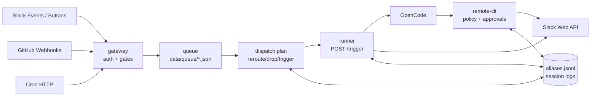

# Event Flow

Stable contracts for how Thor turns external events into resumed OpenCode work.
For operator setup, see [`../slack.md`](../slack.md) and [`../github.md`](../github.md).
For trust boundaries, see [`security-model.md`](./security-model.md).

## Invariants

- `gateway` authenticates external events, applies pre-agent gates, and writes accepted work to the durable queue. It does not call OpenCode directly.
- The queue is the only handoff from gateway intake to runner dispatch. Every queued item has a source, payload, source timestamp, correlation key, and interrupt flag.
- Correlation keys are logical conversation keys. When a key resolves to an anchor, all keys bound to that anchor serialize under the same queue lock.
- Pending keys, such as Slack privacy checks and PR branch resolution, are queue-only. They must reroute to a real key or drop before runner dispatch.
- A dispatched batch has exactly one working directory. Mixed-directory batches are rejected rather than split.
- `runner` is the only service that creates, resumes, interrupts, or replaces OpenCode sessions.
- Accepted runner triggers return quick JSON by default. Gateway does not consume runner progress streams.
- Runner owns Slack progress updates for the current channel-aware Slack thread key.
- `remote-cli` owns tool policy, MCP approval creation, approval-card posting, and outbound alias registration.
- Agents never write the alias index directly.

## Topology



## Intake

All external event routes validate shape and origin before queueing work.

| Source                 | Route                       | Authentication                        | Main correlation key                                 |
| ---------------------- | --------------------------- | ------------------------------------- | ---------------------------------------------------- |
| Slack events           | `POST /slack/events`        | Slack signing secret                  | `slack:thread:<channel>/<threadTs>`                  |
| GitHub webhooks        | `POST /github/webhook`      | `X-Hub-Signature-256`                 | `git:branch:<repo>:<branch>` or `github:issue:<...>` |
| Cron                   | `POST /cron`                | `Authorization: Bearer <CRON_SECRET>` | caller-supplied or derived `cron:<hash>:<time>`      |
| Slack approval buttons | `POST /slack/interactivity` | Slack signing secret                  | originating `slack:thread:<channel>/<threadTs>`      |

Slack first-contact work comes from `app_mention` events. Plain `message` events are accepted only after Thor is already engaged in the thread. Public, non-shared channels are admitted by default; private channels, DMs, group DMs, and Slack Connect/shared channels must be listed in `slack.private_channel_allowlist`. Profiles do not affect Slack admission; profile resolution details live in [`profile.md`](./profile.md). Channel classification failures fail closed.

GitHub first-contact comments must mention the app unless the event belongs to a Thor-owned PR flow or an already-active issue session. Branch-known events use `git:branch:<repo>:<branch>`. PR issue comments that do not include the branch enqueue under `pending:branch-resolve:<repo>:<number>` until dispatch can resolve the PR head. Pure issue sessions use `github:issue:<localRepo>:<repoFullName>#<issueNumber>`.

Cron events are already trusted by `CRON_SECRET`; they do not create aliasable keys unless the caller passes an existing alias-backed key, such as a Slack thread key.

Approval button clicks first resolve the pending action through `remote-cli`, then enqueue an `approval` outcome event so the agent can continue with the human decision in context.

## Queue

Queued files are atomic JSON writes under the queue directory. The queue groups ready files by `resolveCorrelationLockKey(correlationKey)`:

- If the key resolves to an anchor, the lock is `anchor:<anchorId>`.
- If the key has no alias yet, the lock is the raw correlation key.
- Pending keys stay under their raw pending key until they reroute or drop.

This is the core coalescing rule. A Slack reply and a GitHub push for the same anchored conversation become one batch even though their raw keys differ.

Interrupt events, such as Slack mentions, make the batch ready immediately. Non-interrupt events can join an interrupt batch but cannot delay it. A busy runner response leaves the files unsettled so the queue can retry later. Accepted or terminally rejected batches are settled by deleting or dead-lettering the queued files.

## Dispatch

Dispatch turns a ready queue batch into one of three outcomes:

- **Reroute**: resolve a pending key, rewrite the queued events with the real key, and let the next scan process them.
- **Drop**: move invalid or unsafe work to dead-letter with a reason.
- **Trigger**: render a prompt and post it to runner.

Before triggering, every event in the batch must resolve to the same working directory. This prevents one OpenCode prompt from spanning unrelated local checkouts. The known rough edge is cross-source conversations that legitimately bridge repos through aliases; today those mixed-directory batches are dropped instead of split.

Gateway posts runner triggers as JSON:

```json
{
  "prompt": "...",
  "correlationKey": "...",
  "directory": "/workspace/repos/example",
  "interrupt": false
}
```

The default runner response contract is:

- `{ "accepted": true, "sessionId": "...", "resumed": false }` means the prompt was accepted and runner continues processing in the background.
- `{ "busy": true }` means the session is busy and the queue should retry later.
- `4xx` means the batch is terminally rejected.
- `5xx` or transport failure means dispatch should throw and retry.

Runner still supports an explicit `stream: true` trigger mode for smoke tests that need the final response in the HTTP call. Gateway does not use that mode for normal event dispatch.

## Runner

Runner resolves the target session from the request in this order:

1. A direct `sessionId`, if supplied.
2. The current session bound to the request correlation key's anchor.
3. A new session and anchor when no binding exists.

The runner lock is based on the direct session id or resolved correlation lock key, so concurrent triggers for the same logical conversation cannot race-create sessions.

If the target session is busy, `interrupt:false` returns `{ "busy": true }`. `interrupt:true` aborts the in-flight trigger, records it as aborted, waits for OpenCode to become idle, then sends the new prompt.

When OpenCode idles a session on an empty failed assistant message (an error finish with no output), runner sends a single `Continue` nudge to the same session rather than ending the trigger, bounded to a few attempts per run. These nudges stay inside one trigger — no new `trigger_start` is written and the session stays busy throughout — and an empty failure that cannot be recovered is recorded as `trigger_end: error` rather than an empty `completed`. Mechanism and bounds: [`../plan/2026060301_runner-idle-auto-resume.md`](../plan/2026060301_runner-idle-auto-resume.md).

Every accepted trigger writes `trigger_start` and then a terminal `trigger_end` with `completed`, `error`, or `aborted`. The viewer and disclaimer links depend on that lifecycle record, not on gateway state.

## Progress

Runner observes OpenCode events and converts them into Thor progress events. When the current request correlation key is the channel-aware Slack form `slack:thread:<channel>/<threadTs>`, runner sends those progress events to the shared progress engine and its Slack transport.

Progress is intentionally tied to the current trigger key. Runner does not search historical aliases to infer a Slack target for non-Slack triggers. GitHub, cron, and other non-Slack triggers can still resume the same OpenCode session, but they do not create Slack progress messages unless the current trigger itself is a Slack-thread trigger.

Gateway no longer relays or drains runner progress streams.

## Approvals

Approval-card creation is outbound work owned by `remote-cli`.

1. The agent calls an approval-gated MCP tool through `remote-cli`.
2. `remote-cli` validates the approval payload and resolves the calling OpenCode session to an anchor.
3. The anchor must have a current channel-aware Slack trigger; otherwise approval creation fails closed.
4. `remote-cli` persists the pending approval, posts the Slack approval card, and returns an `approval_required` result to the agent.
5. A human clicks Approve or Reject in Slack.
6. Gateway verifies the Slack button request, asks `remote-cli` to resolve the approval, updates the card, and queues an `approval` outcome event.

No usable pending approval is created unless the human-visible Slack card is posted successfully.

## Aliases

Aliases bind external keys and OpenCode entities to an opaque anchor id. The anchor is the durable conversation identity; sessions can be replaced without moving external aliases.

| Alias type            | Value                                     | Purpose                                    |
| --------------------- | ----------------------------------------- | ------------------------------------------ |
| `slack.thread`        | `<channel>/<threadTs>`                    | Slack thread key                           |
| `git.branch`          | `base64url("git:branch:<repo>:<branch>")` | GitHub branch session key                  |
| `github.issue`        | `base64url("github:issue:<...>")`         | GitHub issue session key                   |
| `opencode.session`    | `<sessionId>`                             | OpenCode session bound to an anchor        |
| `opencode.subsession` | `<childSessionId>`                        | Child session bound to the parent's anchor |

Alias records are append-only JSONL. The newest session binding for an anchor is the current session; external aliases do not move. Branch and issue keys are base64url encoded because they contain characters that are awkward in raw JSONL lookup keys. Slack ids and timestamps are stored raw.

Aliases are written only by services that can observe both sides of a binding:

- Runner binds session ids and inbound correlation keys during trigger handling.
- Runner binds sub-sessions discovered on the OpenCode event bus.
- Remote-cli binds git branch aliases after successful `git push`.
- Remote-cli binds Slack thread aliases after controlled Slack posting.
- Remote-cli binds GitHub issue aliases after successful issue create/comment commands.

Aliases are read by the queue for lock grouping, by gateway filters for "already engaged" checks, by runner for session resolution, and by remote-cli for approval/disclaimer routing.

## Example

A user mentions Thor in Slack, Thor opens a PR, then CI pushes a GitHub event back into the same conversation:

1. Slack `app_mention` queues `slack:thread:C123/1701234567.123`.
2. No alias exists, so the queue lock is the raw Slack key.
3. Runner creates an anchor and OpenCode session, then binds both `slack.thread` and `opencode.session` to that anchor.
4. The agent pushes a branch. Remote-cli computes `git:branch:<repo>:<branch>` and binds it to the same anchor.
5. A GitHub push or CI event for that branch queues under the git branch key.
6. The queue resolves that key to the same anchor lock as the Slack thread, so related Slack and GitHub events batch together and resume one OpenCode session.

If the original OpenCode session later goes stale, runner creates a replacement session and appends a new `opencode.session` alias to the same anchor. The Slack thread, git branch, and viewer URL keep pointing at the same logical conversation.
