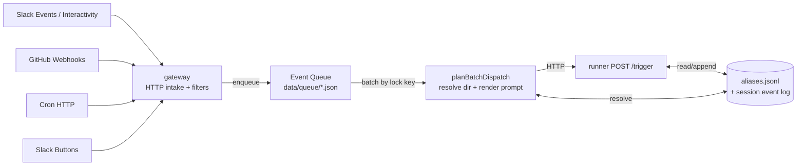
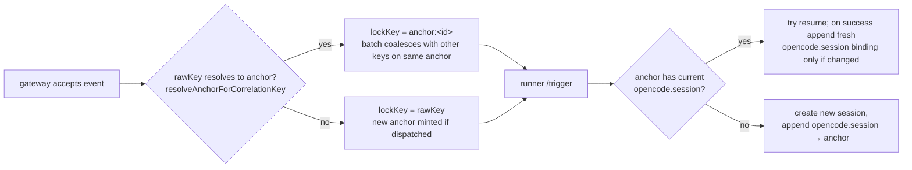

# Event Flow

> Scope: how events move through Thor end-to-end — every external trigger that enters `gateway`, the on-disk queue that coalesces them, the runner endpoint that drives OpenCode sessions, the alias machinery that ties keys to sessions, and the outbound path that emits approval cards back to Slack. Source of truth for inbound and outbound event handling.

## Topology



The entire flow is "raw correlation key in → maybe-resolved anchor out → resumed (or freshly created) OpenCode session". Aliases are how a `slack:thread:1234` becomes `anchor:019df…88` — once that mapping exists, every subsequent event for that thread serializes onto the same anchor lock, resolves to the anchor's current `opencode.session`, and resumes the same OpenCode session.

---

## 1. Gateway intake routes

All routes live in `packages/gateway/src/app.ts`. Each has its own validator, signature check, filter chain, and correlation-key builder. None of them call the runner directly — they all go through `EventQueue.enqueue()`.

### 1.1 `POST /slack/events` — Slack Events API

- **Validator**: `SlackEventEnvelopeSchema` (`packages/gateway/src/slack.ts:47`).
- **Signature**: `verifySlackSignature()` (slack.ts:105) — HMAC-SHA256 with `config.signingSecret`, 5-minute timestamp tolerance.
- **Special case**: `url_verification` payloads echo `challenge` and return.
- **Supported event subtypes**: `app_mention`, `message`, `reaction_added`, `reaction_removed`.
- **Filter chain** (app.ts:1055–1238): drop if bot disabled, empty text, self-message, channel not allow-listed, or duplicate `app_mention` text. `message` events are dropped unless Thor is already engaged in the thread (`hasSessionForCorrelationKey()`); `app_mention` is always forwarded.
- **Channel-surface gate** (`isSlackEventGated` + `isSlackChannelAllowlisted` in `packages/gateway/src/slack-api.ts`, invoked from `shouldIgnoreForGatedChannel` in `app.ts`): every accepted Slack event must originate either from a regular public channel **or** from a conversation id that appears in `slack.private_channel_allowlist` (`packages/common/src/workspace-config.ts`). The decision is made from `event.channel_type`:
  - `"channel"` → admitted without an allowlist check (the only public-by-construction surface).
  - `"group"`, `"im"`, `"mpim"` → require the conversation id to be on the allowlist; otherwise dropped with `history.reason = "private_channel_not_allowlisted"`.
  - missing → the webhook acknowledges 200 immediately and enqueues under a `pending:slack-privacy:` correlation key (analogous to `pending:branch-resolve:` in §3.1). `planBatchDispatch` resolves the surface via `conversations.info` (WebClient's default 10s timeout), applies the allowlist, and either reroutes to the real `slack:thread:…` key or drops with `private_channel_not_allowlisted`. Observed `app_mention` envelopes do not include `channel_type` and always take this path.
    Workspace config load failures, lookup timeouts, and lookup errors **fail closed** — the event is treated as gated and dropped if not on the allowlist, rather than admitted or 5xx'd. The allowlist key name predates a scope broadening that brought DMs and MPIMs under the same rule; the audit reason string (`private_channel_not_allowlisted`) is retained for log-grep continuity even though it now fires for any non-public surface. See `docs/plan/2026052201_private-channel-allowlist.md` for the decision log.
- **Correlation key**: `slack:thread:<channel>/<thread_ts || ts>` when the channel is known, with `slack:thread:<thread_ts || ts>` kept as a legacy lookup fallback. The thread root's `ts` is the Slack thread identifier.
- **Enqueue shape**:
  - `app_mention`: `interrupt=true`, `delayMs=0` (immediate, can preempt a busy session).
  - regular `message`: `interrupt=false`, `delayMs=shortDelay` (~3 s), so multi-line bursts coalesce.
- **Side effect**: posts an "eyes" emoji reaction immediately for `app_mention` so the user sees Thor received the event before the queue drains. Any channel-surface gate rejection adds a `:lock:` reaction to distinguish a policy block from processing failure; `:x:` remains reserved for runtime failure.

### 1.2 `POST /github/webhook` — GitHub webhooks

- **Validator**: `GitHubWebhookEnvelopeSchema` in `packages/gateway/src/github.ts`, a discriminated union over `event_type`.
- **Signature**: `verifyGitHubSignature()` in `packages/gateway/src/github.ts` — HMAC-SHA256 from `X-Hub-Signature-256`, no timestamp window (the digest covers the immutable payload).
- **Supported events**:
  - `issue_comment` (created)
  - `pull_request_review_comment` (created)
  - `pull_request_review` (submitted)
  - `check_suite` (completed)
  - `pull_request` (closed)
  - `push`
- **Repo gate**: every event must map to a workspace directory via the configured `localRepo` mapping. Unmapped repos are logged and dropped.
- **Filter chain** (`shouldIgnoreGitHubEvent`): drops self-sender (the bot's own comments), empty review bodies, and non-mention comments by default. Pure issue comments require a mention for first contact, but once the same `github:issue:` key already resolves to an active session, later follow-up comments on that issue may continue without another mention. PR review/review-comment events are also accepted without a mention when the PR was opened by Thor.
- **Three correlation-key shapes**:
  - **Branch known** (`push`, review/comment events with `head.ref`, completed check suites with `head_branch`): `git:branch:<localRepo>:<branch>` via `buildCorrelationKey()`. Alias value is `base64url(<full key>)`.
  - **PR issue-comment branch unknown** (PR-backed issue comments, where the payload only has the PR number): `pending:branch-resolve:<localRepo>:<number>` via `buildPendingBranchResolveKey()`. The key is parked on the queue with this synthetic prefix and is resolved later (see §3.1).
  - **Pure issue** (mention-gated for first contact; later engaged follow-ups can continue without a mention): `github:issue:<localRepo>:<repoFullName>#<issueNumber>` via `buildIssueCorrelationKey()`. Alias type is `github.issue` with alias value `base64url(<full key>)`.
- **Push events** are special — `handleGitHubPushEvent()` (app.ts:693–856) syncs the worktree (`git fetch`, hard reset, branch delete) and only enqueues a wake-trigger if a session already exists for the branch.
- **Check-suite completed** further requires `verifyThorAuthoredSha()` (`github-gate.ts:9`) — the head commit's author email must match the bot identity. This blocks "CI green for someone else's commit" from re-entering Thor's session.

### 1.3 `POST /cron` — scheduled prompts

- **Validator**: `CronRequestSchema` (`packages/gateway/src/cron.ts:4`) — `{prompt, directory, correlationKey?}`.
- **Auth**: `Authorization: Bearer <CRON_SECRET>`. If `CRON_SECRET` is unset, the route returns 401.
- **Correlation key**: caller-supplied, or derived as `cron:<md5(prompt)>:<unix-seconds>` (`deriveCronCorrelationKey()`, cron.ts:21). Note: cron keys do **not** map to any alias type — they only resolve to a session if the caller passes a key that was previously bound (e.g. `slack:thread:...`).
- **Enqueue shape**: `interrupt=false`, `delayMs=0`. Cron-only batches drain in the foreground — the HTTP response waits for the runner to ack.

### 1.4 `POST /slack/interactivity` — approval buttons

- **Validator**: `SlackInteractivityPayloadSchema` (slack.ts:59). Body is form-encoded `payload=<JSON>`.
- **Signature**: same `verifySlackSignature()` as events.
- **Routing**: only `block_actions` with `action_id ∈ {approval_approve, approval_reject}` are processed. `parseApprovalButtonValue()` decodes the button's `value` field: `v3:<actionId>:<urlEncodedUpstream>:<threadTs>`. Legacy `v2:<actionId>:<upstream>` button values are not accepted by the current parser.
- **Two-stage processing** (app.ts:1266–1316):
  1. Synchronously call `remote-cli` to resolve the approval (`resolveApproval(actionId, decision, ...)`).
  2. Update the original Slack message (✅/❌) and enqueue an **`approval` outcome event**.
- **Correlation key**: gateway builds `slack:thread:<channel>/<threadTs>` plus the legacy `slack:thread:<threadTs>` fallback, then resolves whichever key is already bound. This is the mechanism that lets an approval click resume the originating session.
- **Enqueue shape**: `interrupt=false`, `delayMs=0`. Payload carries `actionId`, `decision`, `reviewer`, `tool`, and the resolution status from remote-cli.

### 1.5 `GET /health` — healthcheck

Not an event source, but it exercises the same correlation/queue surfaces: it pings the runner, remote-cli, counts pending queue files, and flags stale events older than the staleness threshold (default 15 min).

---

## 2. The event queue

All ingestion lands in a single directory queue (`packages/gateway/src/queue.ts`). Files are atomic JSON writes (`tmp` + rename) named `<sourceTs-padded>_<id>.json`.

`QueuedEvent` (queue.ts:28) carries:

| Field            | Purpose                                                                |
| ---------------- | ---------------------------------------------------------------------- |
| `id`             | dedup key — retry with same id overwrites                              |
| `source`         | `slack` \| `github` \| `cron` \| `approval`                            |
| `correlationKey` | raw key from §1 (may still be a `pending:branch-resolve:` placeholder) |
| `payload`        | the original event                                                     |
| `sourceTs`       | event-authoritative time (Slack `ts`, GH `created_at`, etc.)           |
| `readyAt`        | epoch ms after which the batch is eligible                             |
| `delayMs`        | original debounce delay                                                |
| `interrupt`      | if true, this event can preempt a busy session                         |

### 2.1 Lock-key grouping

`scan()` runs every 100 ms and groups files by **`resolveCorrelationLockKey(event.correlationKey)`** (queue.ts:234). This is the critical line that makes ingestion session-aware:

- If the raw key resolves to an anchor → lock key is `anchor:<anchorId>`.
- Otherwise → lock key is the raw key itself.

Two consequences:

1. **Cross-key coalescing.** If a conversation has both a Slack thread and a git branch alias bound to its anchor, a `git:branch:thor:feat-x` push and a `slack:thread:1701...` reply land in the **same batch** because both resolve to the same `anchor:<id>` lock key. The runner sees one combined prompt instead of two parallel triggers.
2. **A pending resolve waits on its own bucket.** `pending:branch-resolve:<repo>:<num>` doesn't match any alias type, so it keeps its raw key as the lock key until §3.1 reroutes it.
3. **Pure issues are durable.** `github:issue:` keys resolve through the `github.issue` alias type, so later mentions on the same issue resume the same session instead of minting a new anchor.

### 2.2 Interrupt-aware batching

When at least one event in a key group has `interrupt=true`, batch readiness is computed from the interrupt events only. Non-interrupt events get swept into the same batch but never delay it. This is how an `app_mention` arriving 50 ms after a `message` cuts straight through the 3-second debounce: the interrupt's `readyAt` is now, the message tags along.

### 2.3 Settlement

The handler must call `ack()` (delete files), `reject(reason)` (move to `dead-letter/`), or return without settling (files stay on disk; retry next scan). A thrown handler also deletes — chosen over infinite retry. Returning unsettled is how the runner says "busy, try again later" without losing events.

---

## 3. From queue to runner: `planBatchDispatch`

`packages/gateway/src/service.ts:443` takes a batch and decides whether to dispatch, drop, or **reroute**.

### 3.1 Pending GitHub branch resolution (the reroute case)

When the batch's correlation key starts with `pending:branch-resolve:`:

1. The latest event must be a PR-backed `issue_comment` (pure issues use `github:issue:` and never enter this path).
2. `resolveGitHubPrHead()` (service.ts:170) calls `gh pr view <num> --json headRefName,headRepository,baseRepository` to fetch the PR head branch.
3. If the head and base repos differ → drop with `fork_pr_unsupported`.
4. Otherwise the plan is `{kind: "reroute", fromCorrelationKey, toCorrelationKey: "git:branch:<repo>:<branch>", githubEvents}`. The handler **re-enqueues** every event with the resolved key. The next queue scan picks them up under the new lock key, where they may now coalesce with an existing branch session.

This is the only place an event's correlation key changes after enqueue. Everything else is read-only routing.

### 3.2 Directory + prompt assembly

For non-pending batches:

- **Directory**: each event resolves to a working directory (Slack channel→repo map, GitHub repo path lookup, cron-supplied, approval channel→repo map). All events in the batch must agree — mixed-directory batches are dropped to dead-letter (service.ts:557). **TODO — improve**: cross-source mixed-directory batches happen legitimately when a conversation bridges repos via aliases (e.g. a Slack thread anchor in repoA's channel ends up bound to a branch in repoB; a later Slack reply and GitHub push then batch under the same `anchor:<id>` with two different directories). Dead-lettering silently drops the user's click/comment, which Slack already 200'd and cannot replay. Worth revisiting; design open.
- **Prompt**: each source has a renderer (`renderSlackPrompt`, `renderGitHubPrompt`, `buildApprovalOutcomePrompt`, raw cron prompt). Parts are joined with `\n\n`.
- **Progress target**: the last Slack event (or approval) provides `{channel, threadTs, ts}` for streaming relays. Cron-only batches have no progress target and drain in the foreground.

### 3.3 The HTTP call

`triggerRunnerPrompt()` (service.ts:376) issues:

```
POST <runnerUrl>/trigger
Content-Type: application/json

{
  "prompt": "<rendered>",
  "correlationKey": "<resolved key>",
  "directory": "<workdir>",
  "interrupt": true|false
}
```

Three response cases:

- `200 application/json` with `{busy: true}` and `interrupt=false` → batch stays unsettled, retried next scan.
- `200 application/x-ndjson` → stream each event to Slack via the progress relay (background) or drain (foreground).
- `4xx` → `reject()` to dead-letter.
- Other → throw, batch retried.

---

## 4. The runner trigger endpoint

`packages/runner/src/index.ts:682` (`POST /trigger`) is the only place sessions are created or resumed.

### 4.1 Lock + session resolution

```ts
lockKey = requestedSessionId
  ? `session:${requestedSessionId}`
  : correlationKey
    ? resolveCorrelationLockKey(correlationKey)
    : undefined;

await withCorrelationKeyLock(lockKey, async () => {
  candidate = requestedSessionId || resolveSessionForCorrelationKey(correlationKey);
  if (candidate && client.session.get({ id: candidate }).data) {
    // resume
  } else if (candidate) {
    // stale → create new + record session.parent alias from candidate → new
  } else {
    // create new
  }
  if (correlationKey) appendCorrelationAlias(newOrResumedId, correlationKey);
});
```

The lock is per-process and per-resolved-key; it prevents two concurrent triggers from race-creating duplicate sessions for the same Slack thread.

### 4.2 Busy handling

If the resolved session is `busy`:

- `interrupt=false`: respond `{busy: true}` and let the gateway re-enqueue.
- `interrupt=true`: end the in-flight trigger as `aborted` (reason `user_interrupt`), call `client.session.abort()`, wait up to `ABORT_TIMEOUT` for the `idle` event. Timeout → 503.

### 4.3 Trigger lifecycle in the session event log

Every trigger emits two records into the per-session JSONL log (`packages/common/src/event-log.ts`):

- `trigger_start` (event-log.ts:29) — `triggerId` (UUID), optional `correlationKey`, optional `triggerSlackId`, optional `triggerGithubLogin`. The user prompt body is recoverable from the opencode_event stream (the first `text` part prefixed with `[correlation-key: <key>]`), so it's not duplicated on this record.
- `trigger_end` (event-log.ts:36) — `status: completed | error | aborted`, `durationMs`, optional `error`, optional `reason`.

**Invariant**: every `trigger_start` is paired with a `trigger_end`. The runner emits `trigger_end` from the Express error path, the abort path above, and the SIGTERM shutdown handler — the log can never end with an open `trigger_start`. The viewer relies on this to compute slice status.

---

## 5. Outbound: approval card emission

Inbound `/slack/interactivity` (§1.4) only handles a button **click**. Posting the approval card in the first place is the outbound counterpart, and `remote-cli` owns it directly when an approval-gated MCP tool is called.

### 5.1 The chain

```mermaid
sequenceDiagram
    autonumber
    participant Agent
    participant RC as remote-cli
    participant Store as approvalStore
    participant Slack

    Agent->>RC: MCP call (e.g. createJiraIssue, args)
    RC->>RC: resolve session -> newest Slack trigger on anchor<br/>must be slack:thread:&lt;channel&gt;/&lt;threadTs&gt;
    RC->>Store: build + persist pending action
    Note right of Store: pending action persisted to<br/>/workspace/data/approvals
    RC->>Slack: chat.postMessage + approval blocks<br/>(Approve / Reject buttons)
    Slack-->>RC: message ts
    RC->>Store: add notification metadata
    RC-->>Agent: tool result = JSON<br/>type=approval_required,<br/>actionId, proxyName, tool, command
    Note over Slack: Human reviews the card<br/>click → POST /slack/interactivity (§1.4)
```

### 5.2 The hand-offs

1. **remote-cli validates approval eligibility** (`packages/remote-cli/src/mcp-handler.ts`). For tools classified `approve`, it first validates the approval payload. For tools requiring a disclaimer (`createJiraIssue`, `addCommentToJiraIssue`, `create-feature-flag`), `validateDisclaimerCompatibleArgs` rejects the call when `args.contentFormat` is set to anything other than `"markdown"`.
2. **remote-cli resolves Slack routing from trigger context.** The MCP call must include `x-thor-session-id`; that session must resolve to an anchor; and the newest Slack trigger on that anchor must have the current Slack correlation-key form `slack:thread:<channel>/<threadTs>`. Non-Slack triggers on the same anchor, such as GitHub follow-ups, do not hide an older usable Slack trigger. The channel/thread are used for the approval card destination.
3. **remote-cli persists the pending action.** It stores the clean input args plus `origin.sessionId`, `{anchorId, triggerId}`, and notification target metadata under `/workspace/data/approvals`.
4. **remote-cli posts the Slack card.** `buildApprovalSlackMessage()` formats a concise approval card and `postSlackMessageApi()` sends `chat.postMessage` using the `remote-cli` service's `SLACK_BOT_TOKEN`. The button value is `v3:<actionId>:<urlEncodedUpstream>:<threadTs>`.
5. **remote-cli records Slack notification metadata.** After Slack returns a message `ts`, the approval action is updated with `notification.messageTs` and `postedAt`.
6. **remote-cli returns the approval JSON to the agent.** The tool result still contains `type:"approval_required"`, `actionId`, `proxyName`, `tool`, and `command`, but runner no longer treats that as a progress event. It is informational output for the agent.
7. **Disclaimer injection happens at approval resolution.** `buildUpstreamArgs(action)` reconstructs the trigger URL from the persisted `origin.trigger` snapshot and `injectApprovalDisclaimer` appends the markdown footer to `description` (Jira create / PostHog create-feature-flag) or `commentBody` (Jira comment) before the approved upstream call runs.

### 5.3 Required preconditions

These things must hold for remote-cli to create a usable pending approval:

- **The MCP call carries `x-thor-session-id`.** Without it, remote-cli cannot bind the approval to a trigger.
- **The session has anchor context.** `opencode.session` or `opencode.subsession` must resolve to an anchor in the JSONL alias index.
- **The anchor has a channel-aware Slack trigger.** GitHub-only, cron-only, and other non-Slack-only anchors do not provide a Slack destination for the approval card.
- **The Slack key is the channel-aware form.** `slack:thread:<channel>/<threadTs>` is required. Legacy `slack:thread:<threadTs>` keys cannot tell remote-cli which channel to post to.
- **remote-cli can post to Slack.** `SLACK_BOT_TOKEN` must be configured in remote-cli and Slack must accept `chat.postMessage` for the target channel/thread.

### 5.4 Failure behavior

Approval card delivery fails closed before the agent can proceed as though a human has been notified:

- If session/anchor/correlation validation fails, no pending approval is created.
- If the pending action is created but Slack posting fails, remote-cli marks that action `rejected` with reviewer `system` and returns an error. The rejected action does not appear in `approval list`.
- Common Slack-side errors are `SLACK_BOT_TOKEN is not set`, `Slack API error: channel_not_found`, `not_in_channel`, `invalid_auth`, transport failures, and responses missing `ts`.
- The agent still sees a non-zero tool result and should retry only after the routing/config issue is fixed or ask the human to continue in a Slack-thread-triggered context.

---

## 6. Aliases — the entire mechanism

External correlation keys (Slack thread, git branch, GitHub issue/PR conversation) and OpenCode entities (sessions, sub-sessions) bind to an opaque **anchor id** — a UUIDv7 with no record of its own that gives all entity types equal-class membership in the same logical conversation. Alias types are declared as a closed enum at `packages/common/src/event-log.ts`:

```ts
export const ALIAS_TYPES = [
  "slack.thread_id",
  "slack.thread",
  "git.branch",
  "github.issue",
  "opencode.session",
  "opencode.subsession",
] as const;
```

Alias values are validated: 1–512 chars, no control characters (`\n`, `\r`, `\t`, `\0`) — anything that could corrupt the JSONL line. Anchor ids are validated as canonical UUIDv7.

### 6.1 Storage

All aliases live in a single append-only file: `<worklog>/aliases.jsonl`. Each line is an `AliasRecord`:

```json
{
  "ts": "...",
  "aliasType": "slack.thread_id",
  "aliasValue": "1701234567.123",
  "anchorId": "019df502-3244-7705-8376-9c23c5e49c88"
}
```

`appendAlias()` writes the line and updates an in-memory cache keyed by `<aliasType>:<aliasValue>` → `anchorId` (forward map) plus a parallel reverse map keyed by `<anchorId>` → `{ sessionIds, subsessionIds, externalKeys, currentSessionId }`. Both maps populate on the same single pass over the file.

`resolveAlias()` looks up the forward map; `reverseLookupAnchor()` returns the bound entities for a given anchor. The cache reloads only when `aliases.jsonl`'s size changes (signature check) — cheap and consistent with append-only semantics.

### 6.2 Alias Types

| Alias type            | Alias value                               | Binding target                 | Created when                                                                                                                              |
| --------------------- | ----------------------------------------- | ------------------------------ | ----------------------------------------------------------------------------------------------------------------------------------------- |
| `slack.thread`        | `<channel>/<thread_ts>` (raw, 1:1)        | anchor for that thread         | (a) gateway accepts a Slack event with channel context; (b) agent calls Slack posting and remote-cli can see both channel and `thread_ts` |
| `slack.thread_id`     | `<thread_ts>` (raw, 1:1)                  | legacy anchor for that thread  | legacy fallback for older sessions and older Slack correlation keys                                                                       |
| `git.branch`          | `base64url("git:branch:<repo>:<branch>")` | anchor for that branch         | (a) gateway accepts a GitHub event for a known branch; (b) remote-cli sees a successful `git push`                                        |
| `github.issue`        | `base64url("github:issue:<...>")`         | anchor for that issue or PR    | (a) gateway accepts a GitHub issue/PR conversation event; (b) remote-cli sees a successful GitHub issue create or comment command         |
| `opencode.session`    | `<sessionId>` (OpenCode format)           | anchor this session belongs to | runner trigger handler appends on every session create/resume; `session_stale` recreate adds a fresh binding alongside the old            |
| `opencode.subsession` | `<childSessionId>` (OpenCode format)      | anchor the parent belongs to   | runner discovers a child session on the OpenCode event bus during an active trigger and binds the child to the parent's anchor            |

The first four are correlation-key aliases — `aliasForCorrelationKey()` is the single function that maps a key prefix to an alias spec:

```ts
"slack:thread:<channel>/<ts>" → {aliasType: "slack.thread", aliasValue: "<channel>/<ts>"}
"slack:thread:<ts>"           → {aliasType: "slack.thread_id", aliasValue: "<ts>"}
"git:branch:..."              → {aliasType: "git.branch", aliasValue: base64url(<full key>)}
"github:issue:..."            → {aliasType: "github.issue", aliasValue: base64url(<full key>)}
otherwise                     → undefined  // includes cron:..., pending:branch-resolve:...
```

This is why `cron:` keys never resolve to an anchor unless the caller passes a different key.

### 6.3 Where aliases are written

| Site                                                | Code                                                                                                          | What it does                                                                                                          |
| --------------------------------------------------- | ------------------------------------------------------------------------------------------------------------- | --------------------------------------------------------------------------------------------------------------------- |
| Runner trigger, on session create/resume            | `index.ts` `appendAlias({aliasType: "opencode.session", aliasValue: id, anchorId})`                           | binds the resumed-or-created session to the resolved/minted anchor                                                    |
| Runner trigger, on first sight of a correlation key | `index.ts` `appendCorrelationAliasForAnchor(anchorId, correlationKey)`                                        | binds the inbound `slack:thread:`, `git:branch:`, or `github:issue:` key to the anchor (idempotent under newest-wins) |
| Runner trigger, on `session_stale` recreate         | `index.ts` `appendAlias({aliasType: "opencode.session", aliasValue: newId, anchorId})`                        | same anchor, new session id — external aliases never move because they bind the anchor, not the session               |
| Runner stream handler, on subagent discovery        | `index.ts` `appendAlias({aliasType: "opencode.subsession", aliasValue: childId, anchorId})`                   | binds the child session to the parent's anchor so disclaimer routing reaches the parent's open trigger                |
| Remote-cli, after successful `git push`             | `remote-cli/src/index.ts` `appendCorrelationAlias(sessionId, computeGitCorrelationKey(args, cwd))`            | resolves the executing session's anchor first (`opencode.session` lookup) then binds `git.branch` to that anchor      |
| Remote-cli, after Slack `post_message` MCP call     | `remote-cli/src/mcp-handler.ts` `appendCorrelationAlias(sessionId, computeSlackCorrelationKey(args, stdout))` | resolves the executing session's anchor first, then binds `slack.thread` when channel is known                        |
| Remote-cli, after successful `gh issue` command     | `remote-cli/src/index.ts` `registerIssueCorrelationAlias(sessionId, args, cwd, stdout)`                       | resolves the executing session's anchor first, then binds `github.issue` for issue create/comment commands            |

The agent itself never touches the alias file — every write happens in code paths that already see both `sessionId` and the correlating identifier.

### 6.4 Where aliases are read



Three call sites read aliases:

1. **`EventQueue.scan()`** — `resolveCorrelationLockKey()` decides batch grouping. This is what makes `slack:thread:X` and `git:branch:Y` for the same anchor share a lock (`anchor:<id>`).
2. **Gateway filters** — `hasSessionForCorrelationKey()` decides whether a non-mention Slack `message` should be forwarded (only if Thor is engaged for that thread) and whether a `check_suite` completed event has a session to wake. "Engaged" means the correlation key resolves to an anchor that has a current `opencode.session`.
3. **Runner trigger** — picks the candidate session id by walking the correlation key → anchor → `currentSessionForAnchor` chain when the gateway didn't pin one explicitly.

**`findActiveTrigger()`** (used by disclaimer routing and the viewer) is anchor-based: it resolves the request session id to its anchor (via `opencode.session` or `opencode.subsession`), reverse-looks-up every `opencode.session` bound to that anchor, and scans each session log for an unclosed `trigger_start`. When more than one bound session has an open trigger (a stale orphan from a runner crash alongside a new live trigger), the **newest by `trigger_start.ts` wins** — the same supersede-by-newest semantics `readTriggerSlice` uses inside a single session, lifted across the anchor's membership set. No depth cap, no cycle detection. Failure modes are `none` / `oversized`.

### 6.5 Non-obvious properties

- **Append-only, no revocation.** A Slack thread alias never points anywhere new after the first write — once `slack:thread:C123/1701...` binds to anchor A, it binds forever. If the OpenCode session under that anchor goes stale, the runner creates a new session and appends `opencode.session → A` for it; the Slack alias never moves. The viewer URL `/runner/v/<A>/<triggerId>` keeps resolving correctly because the anchor is the durable identity.
  - Net effect: a Slack thread can outlive multiple OpenCode sessions, all bound to the same anchor.
- **`git.branch` and `github.issue` aliases are base64url'd** because branch names, repo names, and issue keys contain `/`, `#`, and other characters; the value is round-tripped through the alias schema's safety check. Slack forms use raw channel ids and `ts` values, which are already safe.
- **`pending:branch-resolve:` is an unaliased key**, so it never resolves to an anchor and never coalesces with anything. It's a queue-only construct that exists for at most one batch cycle before §3.1 reroutes it.
- **Per-session-log writes for child events.** OpenCode events from a discovered child sub-session land in the child's own `sessions/<childId>.jsonl`, not the parent's log. The viewer reads only the owner session log when assembling a trigger slice; child activity is intentionally not surfaced inside the parent slice. Sub-sessions remain trackable via `opencode.subsession → anchor` for routing and disclaimer URL correctness.
- **The session log mirrors session-relevant aliases** as `alias` records when explicitly written by the runner, but no `SessionEventLogRecord` variant carries a `sessionId` field — the file path (`sessions/<sessionId>.jsonl`) is the sole source of truth for the owning session id.

---

## 7. Putting it together: a worked example

A user types `@thor look at this PR` in a Slack thread, then later pushes commits to the PR's branch.

1. **Slack mention arrives** → `POST /slack/events` → validator + signature pass → `app_mention` filter pass → enqueue with `correlationKey="slack:thread:C123/1701234567.123"`, `interrupt=true`, `delayMs=0`.
2. **Queue scan** groups the file under the raw key `slack:thread:C123/1701234567.123` (no anchor yet). Batch ready, `planBatchDispatch` resolves channel→repo, builds the prompt, posts to `runner/trigger`.
3. **Runner** has no anchor for the key → mints anchor `019df…88`, appends `(slack.thread, C123/1701234567.123) → 019df…88`. Creates `session abc123`, appends `(opencode.session, abc123) → 019df…88`. Returns NDJSON stream; the agent does work.
4. **Agent pushes a branch** via `git push`. Remote-cli's `/exec/git` shim computes `git:branch:thor:feat-x`, resolves `abc123`'s anchor (`019df…88`), then appends `(git.branch, base64url("git:branch:thor:feat-x")) → 019df…88`. `gh pr create`, checkout/switch, and worktree setup do not create branch aliases. Both correlation keys now bind to the same anchor after the push.
5. **GitHub push webhook fires** → `POST /github/webhook` → `handleGitHubPushEvent` syncs the worktree → `hasSessionForCorrelationKey("git:branch:thor:feat-x")` returns true (the key resolves to anchor `019df…88` which has a current `opencode.session`) → enqueue with `interrupt=false`.
6. **Queue scan** sees the new file. `resolveCorrelationLockKey("git:branch:thor:feat-x")` → `anchor:019df…88`. If a Slack reply also arrived in the same window, it has lock key `anchor:019df…88` too — they batch together. One `runner/trigger` call, one resumed session, one combined prompt.

That last step — two different correlation keys becoming one batch through anchor resolution — is the entire point of the aliasing layer.

If the original OpenCode session goes stale between steps 3 and 5, step 6's runner creates a new session and appends `(opencode.session, abc456) → 019df…88` alongside the old binding. The Slack and git aliases never move; the disclaimer URL `/runner/v/019df…88/<triggerId>` keeps resolving correctly.
