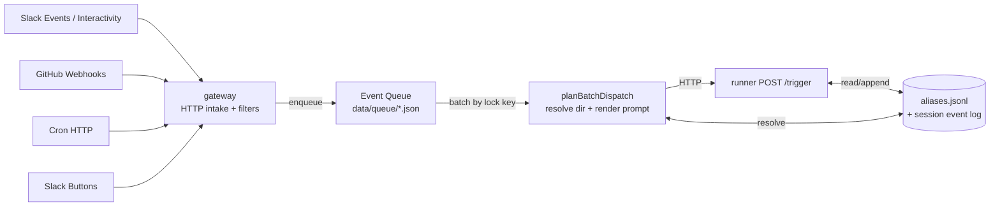
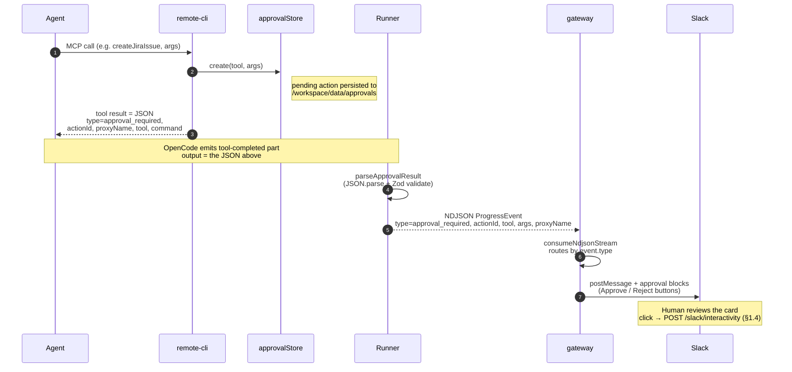
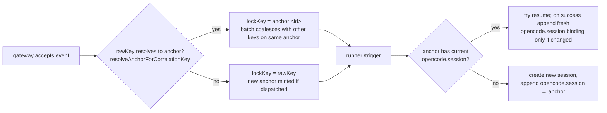

# Event Flow

> Scope: how events move through Thor end-to-end — every external trigger that enters `gateway`, the on-disk queue that coalesces them, the runner endpoint that drives OpenCode sessions, the alias machinery that ties keys to sessions, and the outbound path that emits approval cards back to Slack. Source of truth for inbound and outbound event handling.

## Topology



The entire flow is "raw correlation key in → maybe-resolved anchor out → resumed (or freshly created) OpenCode session". Aliases are how a `slack:thread:1234` becomes `anchor:019df…88` — once that mapping exists, every subsequent event for that thread serializes onto the same anchor lock, resolves to the anchor's current `opencode.session`, and resumes the same OpenCode session.

---

## 1. Gateway intake routes

All routes live in `packages/gateway/src/app.ts`. Each has its own validator, signature check, filter chain, and correlation-key builder. None of them call the runner directly — they all go through `EventQueue.enqueue()`.

### 1.1 `POST /slack/events` — Slack Events API

- **Validator**: `SlackEventEnvelopeSchema` (`packages/gateway/src/slack.ts:47`).
- **Signature**: `verifySlackSignature()` (slack.ts:105) — HMAC-SHA256 with `config.signingSecret`, 5-minute timestamp tolerance.
- **Special case**: `url_verification` payloads echo `challenge` and return.
- **Supported event subtypes**: `app_mention`, `message`, `reaction_added`, `reaction_removed`.
- **Filter chain** (app.ts:1055–1238): drop if bot disabled, empty text, self-message, channel not allow-listed, or duplicate `app_mention` text. `message` events are dropped unless Thor is already engaged in the thread (`hasSessionForCorrelationKey()`); `app_mention` is always forwarded.
- **Correlation key**: `slack:thread:<thread_ts || ts>` via `getSlackCorrelationKey()` (slack.ts:148). The thread root's `ts` is the alias value.
- **Enqueue shape**:
  - `app_mention`: `interrupt=true`, `delayMs=0` (immediate, can preempt a busy session).
  - regular `message`: `interrupt=false`, `delayMs=shortDelay` (~3 s), so multi-line bursts coalesce.
- **Side effect**: posts an "eyes" emoji reaction so the user sees Thor received the event before the queue drains.

### 1.2 `POST /github/webhook` — GitHub webhooks

- **Validator**: `GitHubWebhookEnvelopeSchema` in `packages/gateway/src/github.ts`, a discriminated union over `event_type`.
- **Signature**: `verifyGitHubSignature()` in `packages/gateway/src/github.ts` — HMAC-SHA256 from `X-Hub-Signature-256`, no timestamp window (the digest covers the immutable payload).
- **Supported events**:
  - `issue_comment` (created)
  - `pull_request_review_comment` (created)
  - `pull_request_review` (submitted)
  - `check_suite` (completed)
  - `pull_request` (closed)
  - `push`
- **Repo gate**: every event must map to a workspace directory via the configured `localRepo` mapping. Unmapped repos are logged and dropped.
- **Filter chain** (`shouldIgnoreGitHubEvent`): drops self-sender (the bot's own comments), empty review bodies, and non-mention comments by default. Pure issue comments require a mention for first contact, but once the same `github:issue:` key already resolves to an active session, later follow-up comments on that issue may continue without another mention. PR review/review-comment events are also accepted without a mention when the PR was opened by Thor.
- **Three correlation-key shapes**:
  - **Branch known** (`push`, review/comment events with `head.ref`, completed check suites with `head_branch`): `git:branch:<localRepo>:<branch>` via `buildCorrelationKey()`. Alias value is `base64url(<full key>)`.
  - **PR issue-comment branch unknown** (PR-backed issue comments, where the payload only has the PR number): `pending:branch-resolve:<localRepo>:<number>` via `buildPendingBranchResolveKey()`. The key is parked on the queue with this synthetic prefix and is resolved later (see §3.1).
  - **Pure issue** (mention-gated for first contact; later engaged follow-ups can continue without a mention): `github:issue:<localRepo>:<repoFullName>#<issueNumber>` via `buildIssueCorrelationKey()`. Alias type is `github.issue` with alias value `base64url(<full key>)`.
- **Push events** are special — `handleGitHubPushEvent()` (app.ts:693–856) syncs the worktree (`git fetch`, hard reset, branch delete) and only enqueues a wake-trigger if a session already exists for the branch.
- **Check-suite completed** further requires `verifyThorAuthoredSha()` (`github-gate.ts:9`) — the head commit's author email must match the bot identity. This blocks "CI green for someone else's commit" from re-entering Thor's session.

### 1.3 `POST /cron` — scheduled prompts

- **Validator**: `CronRequestSchema` (`packages/gateway/src/cron.ts:4`) — `{prompt, directory, correlationKey?}`.
- **Auth**: `Authorization: Bearer <CRON_SECRET>`. If `CRON_SECRET` is unset, the route returns 401.
- **Correlation key**: caller-supplied, or derived as `cron:<md5(prompt)>:<unix-seconds>` (`deriveCronCorrelationKey()`, cron.ts:21). Note: cron keys do **not** map to any alias type — they only resolve to a session if the caller passes a key that was previously bound (e.g. `slack:thread:...`).
- **Enqueue shape**: `interrupt=false`, `delayMs=0`. Cron-only batches drain in the foreground — the HTTP response waits for the runner to ack.

### 1.4 `POST /slack/interactivity` — approval buttons

- **Validator**: `SlackInteractivityPayloadSchema` (slack.ts:59). Body is form-encoded `payload=<JSON>`.
- **Signature**: same `verifySlackSignature()` as events.
- **Routing**: only `block_actions` with `action_id ∈ {approval_approve, approval_reject}` are processed. `parseApprovalButtonValue()` (`packages/gateway/src/approval.ts:59`) decodes the button's `value` field — `v3:<actionId>:<urlEncodedUpstream>:<threadTs>` (current) or `v2:<actionId>:<upstream>` (legacy).
- **Two-stage processing** (app.ts:1266–1316):
  1. Synchronously call `remote-cli` to resolve the approval (`resolveApproval(actionId, decision, ...)`).
  2. Update the original Slack message (✅/❌) and enqueue an **`approval` outcome event**.
- **Correlation key**: `slack:thread:<threadTs>` — same key the agent's `post_message` produced when it asked for approval. This is the single mechanism that lets an approval click resume the originating session.
- **Enqueue shape**: `interrupt=false`, `delayMs=0`. Payload carries `actionId`, `decision`, `reviewer`, `tool`, and the resolution status from remote-cli.

### 1.5 `GET /health` — healthcheck

Not an event source, but it exercises the same correlation/queue surfaces: it pings the runner, remote-cli, counts pending queue files, and flags stale events older than the staleness threshold (default 15 min).

---

## 2. The event queue

All ingestion lands in a single directory queue (`packages/gateway/src/queue.ts`). Files are atomic JSON writes (`tmp` + rename) named `<sourceTs-padded>_<id>.json`.

`QueuedEvent` (queue.ts:28) carries:

| Field            | Purpose                                                                |
| ---------------- | ---------------------------------------------------------------------- |
| `id`             | dedup key — retry with same id overwrites                              |
| `source`         | `slack` \| `github` \| `cron` \| `approval`                            |
| `correlationKey` | raw key from §1 (may still be a `pending:branch-resolve:` placeholder) |
| `payload`        | the original event                                                     |
| `sourceTs`       | event-authoritative time (Slack `ts`, GH `created_at`, etc.)           |
| `readyAt`        | epoch ms after which the batch is eligible                             |
| `delayMs`        | original debounce delay                                                |
| `interrupt`      | if true, this event can preempt a busy session                         |

### 2.1 Lock-key grouping

`scan()` runs every 100 ms and groups files by **`resolveCorrelationLockKey(event.correlationKey)`** (queue.ts:234). This is the critical line that makes ingestion session-aware:

- If the raw key resolves to an anchor → lock key is `anchor:<anchorId>`.
- Otherwise → lock key is the raw key itself.

Two consequences:

1. **Cross-key coalescing.** If a conversation has both a Slack thread and a git branch alias bound to its anchor, a `git:branch:thor:feat-x` push and a `slack:thread:1701...` reply land in the **same batch** because both resolve to the same `anchor:<id>` lock key. The runner sees one combined prompt instead of two parallel triggers.
2. **A pending resolve waits on its own bucket.** `pending:branch-resolve:<repo>:<num>` doesn't match any alias type, so it keeps its raw key as the lock key until §3.1 reroutes it.
3. **Pure issues are durable.** `github:issue:` keys resolve through the `github.issue` alias type, so later mentions on the same issue resume the same session instead of minting a new anchor.

### 2.2 Interrupt-aware batching

When at least one event in a key group has `interrupt=true`, batch readiness is computed from the interrupt events only. Non-interrupt events get swept into the same batch but never delay it. This is how an `app_mention` arriving 50 ms after a `message` cuts straight through the 3-second debounce: the interrupt's `readyAt` is now, the message tags along.

### 2.3 Settlement

The handler must call `ack()` (delete files), `reject(reason)` (move to `dead-letter/`), or return without settling (files stay on disk; retry next scan). A thrown handler also deletes — chosen over infinite retry. Returning unsettled is how the runner says "busy, try again later" without losing events.

---

## 3. From queue to runner: `planBatchDispatch`

`packages/gateway/src/service.ts:443` takes a batch and decides whether to dispatch, drop, or **reroute**.

### 3.1 Pending GitHub branch resolution (the reroute case)

When the batch's correlation key starts with `pending:branch-resolve:`:

1. The latest event must be a PR-backed `issue_comment` (pure issues use `github:issue:` and never enter this path).
2. `resolveGitHubPrHead()` (service.ts:170) calls `gh pr view <num> --json headRefName,headRepository,baseRepository` to fetch the PR head branch.
3. If the head and base repos differ → drop with `fork_pr_unsupported`.
4. Otherwise the plan is `{kind: "reroute", fromCorrelationKey, toCorrelationKey: "git:branch:<repo>:<branch>", githubEvents}`. The handler **re-enqueues** every event with the resolved key. The next queue scan picks them up under the new lock key, where they may now coalesce with an existing branch session.

This is the only place an event's correlation key changes after enqueue. Everything else is read-only routing.

### 3.2 Directory + prompt assembly

For non-pending batches:

- **Directory**: each event resolves to a working directory (Slack channel→repo map, GitHub repo path lookup, cron-supplied, approval channel→repo map). All events in the batch must agree — mixed-directory batches are dropped to dead-letter (service.ts:557). **TODO — improve**: cross-source mixed-directory batches happen legitimately when a conversation bridges repos via aliases (e.g. a Slack thread anchor in repoA's channel ends up bound to a branch in repoB; a later Slack reply and GitHub push then batch under the same `anchor:<id>` with two different directories). Dead-lettering silently drops the user's click/comment, which Slack already 200'd and cannot replay. Worth revisiting; design open.
- **Prompt**: each source has a renderer (`renderSlackPrompt`, `renderGitHubPrompt`, `buildApprovalOutcomePrompt`, raw cron prompt). Parts are joined with `\n\n`.
- **Progress target**: the last Slack event (or approval) provides `{channel, threadTs, ts}` for streaming relays. Cron-only batches have no progress target and drain in the foreground.

### 3.3 The HTTP call

`triggerRunnerPrompt()` (service.ts:376) issues:

```
POST <runnerUrl>/trigger
Content-Type: application/json

{
  "prompt": "<rendered>",
  "correlationKey": "<resolved key>",
  "directory": "<workdir>",
  "interrupt": true|false
}
```

Three response cases:

- `200 application/json` with `{busy: true}` and `interrupt=false` → batch stays unsettled, retried next scan.
- `200 application/x-ndjson` → stream each event to Slack via the progress relay (background) or drain (foreground).
- `4xx` → `reject()` to dead-letter.
- Other → throw, batch retried.

---

## 4. The runner trigger endpoint

`packages/runner/src/index.ts:682` (`POST /trigger`) is the only place sessions are created or resumed.

### 4.1 Lock + session resolution

```ts
lockKey = requestedSessionId
  ? `session:${requestedSessionId}`
  : correlationKey
    ? resolveCorrelationLockKey(correlationKey)
    : undefined;

await withCorrelationKeyLock(lockKey, async () => {
  candidate = requestedSessionId || resolveSessionForCorrelationKey(correlationKey);
  if (candidate && client.session.get({ id: candidate }).data) {
    // resume
  } else if (candidate) {
    // stale → create new + record session.parent alias from candidate → new
  } else {
    // create new
  }
  if (correlationKey) appendCorrelationAlias(newOrResumedId, correlationKey);
});
```

The lock is per-process and per-resolved-key; it prevents two concurrent triggers from race-creating duplicate sessions for the same Slack thread.

### 4.2 Busy handling

If the resolved session is `busy`:

- `interrupt=false`: respond `{busy: true}` and let the gateway re-enqueue.
- `interrupt=true`: end the in-flight trigger as `aborted` (reason `user_interrupt`), call `client.session.abort()`, wait up to `ABORT_TIMEOUT` for the `idle` event. Timeout → 503.

### 4.3 Trigger lifecycle in the session event log

Every trigger emits two records into the per-session JSONL log (`packages/common/src/event-log.ts`):

- `trigger_start` (event-log.ts:29) — `triggerId` (UUID), `correlationKey`, `promptPreview`.
- `trigger_end` (event-log.ts:36) — `status: completed | error | aborted`, `durationMs`, optional `error`, optional `reason`.

**Invariant**: every `trigger_start` is paired with a `trigger_end`. The runner emits `trigger_end` from the Express error path, the abort path above, and the SIGTERM shutdown handler — the log can never end with an open `trigger_start`. The viewer relies on this to compute slice status.

---

## 5. Outbound: approval card emission

Inbound `/slack/interactivity` (§1.4) only handles a button **click**. Posting the approval card in the first place is the outbound counterpart, and it rides the runner→gateway NDJSON stream rather than any direct call.

### 5.1 The chain



### 5.2 The hand-offs

1. **remote-cli creates the approval** (`packages/remote-cli/src/mcp-handler.ts`). For tools classified `approve`, it calls `approvalStore.create(toolName, args, { sessionId, anchor })` and returns a tool result whose body is `JSON.stringify({type:"approval_required", actionId, proxyName, tool, command})`. For tools requiring a disclaimer (`createJiraIssue`, `addCommentToJiraIssue`, `create-feature-flag`) two pre-checks run before the action is persisted: `validateDisclaimerCompatibleArgs` rejects the call when `args.contentFormat` is set to anything other than `"markdown"` (we cannot append a markdown footer to ADF or other structured payloads); anchor context resolution snapshots `{anchorId, triggerId?}` when available and only fails closed when no Thor anchor context can be inferred. The args persisted to disk and shown in the Slack approval card are the user's clean input — no footer. The disclaimer is appended only at resolve time: `buildUpstreamArgs(action)` reconstructs the canonical anchor URL from the persisted `origin.anchor` snapshot (old `origin.trigger` records remain readable) and `injectApprovalDisclaimer` appends the markdown footer to `description` (Jira create / PostHog create-feature-flag) or `commentBody` (Jira comment). The action persists to `/workspace/data/approvals` regardless of what happens downstream.
2. **OpenCode emits the tool completion** through the session event bus. The output string is whatever remote-cli returned, byte-for-byte.
3. **Runner extracts the approval signal** in the per-tool branch of the stream handler (runner index.ts:1096). For every completed tool, `parseApprovalResult(output, tool, args)` (index.ts:1249) attempts `JSON.parse(output)` and validates the result against `ApprovalRequiredOutputSchema`. On success it returns a `ProgressEvent` `{type:"approval_required", actionId, tool, args, proxyName}`; on any failure it returns `undefined`. The event, if produced, is written into the NDJSON response stream alongside other progress events.
4. **Gateway routes the event** in `consumeNdjsonStream` (`packages/gateway/src/service.ts:692`). The `approval_required` type is special-cased to `forwardApprovalNotification(channel, threadTs, event, slackDeps)` rather than the generic `handleProgressEvent` path.
5. **Slack post** is built by `forwardApprovalNotification` (service.ts:931): `formatApprovalArgs(event.args)` produces a Slack-safe JSON snippet (with depth/length trimming for the 3000-char block limit), `buildApprovalButtonValue({actionId, upstreamName, threadTs})` produces the `v3:` button payload, `buildInlineApprovalBlocks(tool, argsJson, buttonValue)` assembles the blocks, and `postMessage()` posts to the thread. The button's `threadTs` is what later closes the loop in §1.4 — clicking the button enqueues an approval-outcome event with `slack:thread:<threadTs>` so the gateway resolves it back to the same session.

### 5.3 Required preconditions

Two things must hold for the Slack card to actually post:

- **The trigger has a progress target.** `consumeNdjsonStream` only runs when the runner trigger had a `progressTarget` (Slack channel + thread + ts). `buildProgressTarget` (service.ts:280) derives this from the last Slack event or the last approval-outcome event in the batch. **Cron-only batches have no progress target**, so an approval emitted from a cron-only run is drained silently — there's no thread to post to. This is consistent with cron design (cron jobs route their own output via the prompt), not a bug.
- **The runner's response is the NDJSON stream**, not the `{busy:true}` JSON short-circuit. Approvals can only originate inside an actively-streaming trigger, so this is automatic in practice.

### 5.4 Known weakness — fragile to tool-output handling

`parseApprovalResult` requires the **entire** tool output to be the approval JSON. This works perfectly when the agent calls the MCP tool natively (OpenCode → MCP server → remote-cli → returns clean JSON), but the agent has bash and a wrapper CLI (`mcp` per `build.md:40`), so it can also reach the same write tool via shell. Anything that munges the output between remote-cli and the runner breaks detection:

| Agent invocation                         | Output reaching `parseApprovalResult`      | Slack card |
| ---------------------------------------- | ------------------------------------------ | ---------- |
| Native MCP call                          | `{"type":"approval_required",...}`         | ✅         |
| `mcp call <tool> ...` (bash, no munging) | same JSON, maybe trailing `\n`             | ✅         |
| `mcp call ... \| jq .actionId`           | `"abc-123"\n`                              | ❌         |
| `mcp call ... > /tmp/out.json`           | empty                                      | ❌         |
| `echo "calling..."; mcp call ...`        | leading text + JSON                        | ❌         |
| Same call inside a `task()` subagent     | parent sees subagent summary, not raw JSON | ❌         |

In all the failure cases the **action is still persisted** in `approvalStore` — nothing is dropped at the policy layer — but no Slack notification fires. The human can only discover the pending action by polling `approval status <id>`, which they wouldn't think to do.

**TODO — improve.** Worth revisiting; design open.

---

## 6. Aliases — the entire mechanism

External correlation keys (Slack thread, git branch) and OpenCode entities (sessions, sub-sessions) bind to an opaque **anchor id** — a UUIDv7 with no record of its own that gives all four entity types equal-class membership in the same logical conversation. There are exactly **four alias types**, declared as a closed enum at `packages/common/src/event-log.ts`:

```ts
export const ALIAS_TYPES = [
  "slack.thread_id",
  "git.branch",
  "opencode.session",
  "opencode.subsession",
] as const;
```

Alias values are validated: 1–512 chars, no control characters (`\n`, `\r`, `\t`, `\0`) — anything that could corrupt the JSONL line. Anchor ids are validated as canonical UUIDv7.

### 6.1 Storage

All aliases live in a single append-only file: `<worklog>/aliases.jsonl`. Each line is an `AliasRecord`:

```json
{
  "ts": "...",
  "aliasType": "slack.thread_id",
  "aliasValue": "1701234567.123",
  "anchorId": "019df502-3244-7705-8376-9c23c5e49c88"
}
```

`appendAlias()` writes the line and updates an in-memory cache keyed by `<aliasType>:<aliasValue>` → `anchorId` (forward map) plus a parallel reverse map keyed by `<anchorId>` → `{ sessionIds, subsessionIds, externalKeys, currentSessionId }`. Both maps populate on the same single pass over the file.

`resolveAlias()` looks up the forward map; `reverseLookupAnchor()` returns the bound entities for a given anchor. The cache reloads only when `aliases.jsonl`'s size changes (signature check) — cheap and consistent with append-only semantics.

### 6.2 The four alias types

| Alias type            | Alias value                               | Binding target                 | Created when                                                                                                                                            |
| --------------------- | ----------------------------------------- | ------------------------------ | ------------------------------------------------------------------------------------------------------------------------------------------------------- |
| `slack.thread_id`     | `<thread_ts>` (raw, 1:1)                  | anchor for that thread         | (a) gateway accepts a Slack event for an engaged thread; (b) agent calls `slack post_message` and remote-cli sees a `thread_ts` in the args or response |
| `git.branch`          | `base64url("git:branch:<repo>:<branch>")` | anchor for that branch         | (a) gateway accepts a GitHub event for a known branch; (b) remote-cli sees a successful `git push`                                                      |
| `opencode.session`    | `<sessionId>` (OpenCode format)           | anchor this session belongs to | runner trigger handler appends on every session create/resume; `session_stale` recreate adds a fresh binding alongside the old                          |
| `opencode.subsession` | `<childSessionId>` (OpenCode format)      | anchor the parent belongs to   | runner discovers a child session on the OpenCode event bus during an active trigger and binds the child to the parent's anchor                          |

The first two are correlation-key aliases — `aliasForCorrelationKey()` is the single function that maps a key prefix to an alias spec:

```ts
"slack:thread:..."  → {aliasType: "slack.thread_id", aliasValue: <suffix>}
"git:branch:..."    → {aliasType: "git.branch", aliasValue: base64url(<full key>)}
otherwise           → undefined  // includes cron:..., pending:branch-resolve:...
```

This is why `cron:` keys never resolve to an anchor unless the caller passes a different key.

### 6.3 Where aliases are written

| Site                                                | Code                                                                                                          | What it does                                                                                                     |
| --------------------------------------------------- | ------------------------------------------------------------------------------------------------------------- | ---------------------------------------------------------------------------------------------------------------- |
| Runner trigger, on session create/resume            | `index.ts` `appendAlias({aliasType: "opencode.session", aliasValue: id, anchorId})`                           | binds the resumed-or-created session to the resolved/minted anchor                                               |
| Runner trigger, on first sight of a correlation key | `index.ts` `appendCorrelationAliasForAnchor(anchorId, correlationKey)`                                        | binds the inbound `slack:thread:` or `git:branch:` key to the anchor (idempotent under newest-wins)              |
| Runner trigger, on `session_stale` recreate         | `index.ts` `appendAlias({aliasType: "opencode.session", aliasValue: newId, anchorId})`                        | same anchor, new session id — Slack/git aliases never move because they bind the anchor, not the session         |
| Runner stream handler, on subagent discovery        | `index.ts` `appendAlias({aliasType: "opencode.subsession", aliasValue: childId, anchorId})`                   | binds the child session to the parent's anchor so disclaimer routing reaches the parent's open trigger           |
| Remote-cli, after successful `git push`             | `remote-cli/src/index.ts` `appendCorrelationAlias(sessionId, computeGitCorrelationKey(args, cwd))`            | resolves the executing session's anchor first (`opencode.session` lookup) then binds `git.branch` to that anchor |
| Remote-cli, after Slack `post_message` MCP call     | `remote-cli/src/mcp-handler.ts` `appendCorrelationAlias(sessionId, computeSlackCorrelationKey(args, stdout))` | resolves the executing session's anchor first, then binds `slack.thread_id` to that anchor                       |

The agent itself never touches the alias file — every write happens in code paths that already see both `sessionId` and the correlating identifier.

### 6.4 Where aliases are read



Three call sites read aliases:

1. **`EventQueue.scan()`** — `resolveCorrelationLockKey()` decides batch grouping. This is what makes `slack:thread:X` and `git:branch:Y` for the same anchor share a lock (`anchor:<id>`).
2. **Gateway filters** — `hasSessionForCorrelationKey()` decides whether a non-mention Slack `message` should be forwarded (only if Thor is engaged for that thread) and whether a `check_suite` completed event has a session to wake. "Engaged" means the correlation key resolves to an anchor that has a current `opencode.session`.
3. **Runner trigger** — picks the candidate session id by walking the correlation key → anchor → `currentSessionForAnchor` chain when the gateway didn't pin one explicitly.

**`findActiveTrigger()`** (used by disclaimer routing and the viewer) is anchor-based: it resolves the request session id to its anchor (via `opencode.session` or `opencode.subsession`), reverse-looks-up every `opencode.session` bound to that anchor, and scans each session log for an unclosed `trigger_start`. When more than one bound session has an open trigger (a stale orphan from a runner crash alongside a new live trigger), the **newest by `trigger_start.ts` wins** — the same supersede-by-newest semantics `readTriggerSlice` uses inside a single session, lifted across the anchor's membership set. No depth cap, no cycle detection. Failure modes are `none` / `oversized`.

### 6.5 Non-obvious properties

- **Append-only, no revocation.** A `slack.thread_id` alias never points anywhere new after the first write — once `slack:thread:1701...` binds to anchor A, it binds forever. If the OpenCode session under that anchor goes stale, the runner creates a new session and appends `opencode.session → A` for it; the Slack alias never moves. The canonical viewer URL `/runner/v/<A>` keeps resolving correctly because the anchor is the durable identity; exact trigger deep links remain available at `/runner/v/<A>/t/<triggerId>`.
  - Net effect: a Slack thread can outlive multiple OpenCode sessions, all bound to the same anchor.
- **`git.branch` aliases are base64url'd** because branch names contain `/` and other characters; the value is round-tripped through the alias schema's safety check. The Slack form uses the raw `ts` (digits + dot) which is already safe.
- **`pending:branch-resolve:` is an unaliased key**, so it never resolves to an anchor and never coalesces with anything. It's a queue-only construct that exists for at most one batch cycle before §3.1 reroutes it.
- **Per-session-log writes for child events.** OpenCode events from a discovered child sub-session land in the child's own `sessions/<childId>.jsonl`, not the parent's log. The viewer reads only the owner session log when assembling a trigger slice; child activity is intentionally not surfaced inside the parent slice. Sub-sessions remain trackable via `opencode.subsession → anchor` for routing and disclaimer URL correctness.
- **The session log mirrors session-relevant aliases** as `alias` records when explicitly written by the runner, but no `SessionEventLogRecord` variant carries a `sessionId` field — the file path (`sessions/<sessionId>.jsonl`) is the sole source of truth for the owning session id.

---

## 7. Putting it together: a worked example

A user types `@thor look at this PR` in a Slack thread, then later pushes commits to the PR's branch.

1. **Slack mention arrives** → `POST /slack/events` → validator + signature pass → `app_mention` filter pass → enqueue with `correlationKey="slack:thread:1701234567.123"`, `interrupt=true`, `delayMs=0`.
2. **Queue scan** groups the file under the raw key `slack:thread:1701234567.123` (no anchor yet). Batch ready, `planBatchDispatch` resolves channel→repo, builds the prompt, posts to `runner/trigger`.
3. **Runner** has no anchor for the key → mints anchor `019df…88`, appends `(slack.thread_id, 1701234567.123) → 019df…88`. Creates `session abc123`, appends `(opencode.session, abc123) → 019df…88`. Returns NDJSON stream; the agent does work.
4. **Agent pushes a branch** via `git push`. Remote-cli's `/exec/git` shim computes `git:branch:thor:feat-x`, resolves `abc123`'s anchor (`019df…88`), then appends `(git.branch, base64url("git:branch:thor:feat-x")) → 019df…88`. `gh pr create`, checkout/switch, and worktree setup do not create branch aliases. Both correlation keys now bind to the same anchor after the push.
5. **GitHub push webhook fires** → `POST /github/webhook` → `handleGitHubPushEvent` syncs the worktree → `hasSessionForCorrelationKey("git:branch:thor:feat-x")` returns true (the key resolves to anchor `019df…88` which has a current `opencode.session`) → enqueue with `interrupt=false`.
6. **Queue scan** sees the new file. `resolveCorrelationLockKey("git:branch:thor:feat-x")` → `anchor:019df…88`. If a Slack reply also arrived in the same window, it has lock key `anchor:019df…88` too — they batch together. One `runner/trigger` call, one resumed session, one combined prompt.

That last step — two different correlation keys becoming one batch through anchor resolution — is the entire point of the aliasing layer.

If the original OpenCode session goes stale between steps 3 and 5, step 6's runner creates a new session and appends `(opencode.session, abc456) → 019df…88` alongside the old binding. The Slack and git aliases never move; the disclaimer URL `/runner/v/019df…88` keeps resolving correctly.
