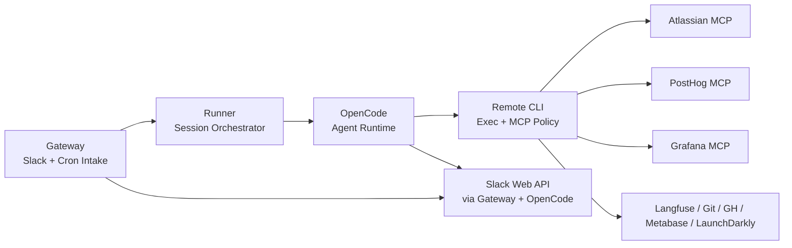

# Integrations

> Scope: Thor is an internal AI teammate for engineering and product work. It is not meant to mirror production infra exactly.

This doc is the canonical index of external systems Thor reaches into, how they're wired, and what they're used for. For the event/correlation mechanics, see [`event-flow.md`](./event-flow.md). For trust boundaries and tool-policy enforcement, see [`security-model.md`](./security-model.md).

## Topology

## Integration matrix

| Integration      | Path                                               | Auth                    | Notes                                                   |
| ---------------- | -------------------------------------------------- | ----------------------- | ------------------------------------------------------- |
| Git / GitHub CLI | `remote-cli /exec/git`, `/exec/gh`                 | GitHub App token        | Repo-scoped worktree edits                              |
| Atlassian MCP    | `remote-cli /exec/mcp`                             | `ATLASSIAN_AUTH` header | Read + approved writes                                  |
| PostHog MCP      | `remote-cli /exec/mcp`                             | API key                 | Read + approved writes                                  |
| Grafana MCP      | `remote-cli /exec/mcp`                             | Service account token   | Logs and observability                                  |
| Slack Web API    | `gateway` + `remote-cli` + OpenCode over mitmproxy | Bot token               | Mentions, progress, approval cards, thread reads/writes |
| Langfuse         | `remote-cli /exec/langfuse`                        | API key pair            | Read-only trace queries                                 |
| LaunchDarkly     | `remote-cli /exec/ldcli`                           | Access token            | Read-only feature flag inspection                       |
| Metabase         | `remote-cli /exec/metabase`                        | API key                 | Read-only warehouse access                              |

## Usage patterns

Concrete examples of how these integrations get combined in a single agent task.

### PR merged, errors spike

A scheduled prompt checks PostHog, sees an error spike, inspects recent merges through GitHub tools, prepares a fix in a worktree, and requests approval for the final write action.

### Jira issue triage

A webhook or Slack prompt asks Thor to investigate a Jira issue. Thor reads the issue, checks recent commits, and reports likely code owners and suspects.

### Daily delivery digest

A cron job asks Thor to summarize stale PRs, blocked issues, or failing tests and post the result to Slack.
