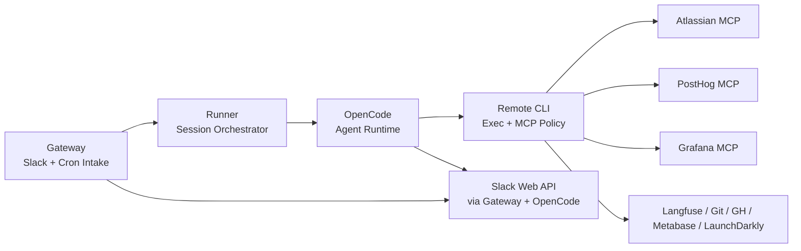

# Thor — AI Team Member Architecture

> Scope: Thor is an internal AI teammate for engineering and product work. It is not meant to mirror production infra exactly.

## Core Topology

## Integration Strategy

| Integration      | Path                                | Auth                    | Notes                                              |
| ---------------- | ----------------------------------- | ----------------------- | -------------------------------------------------- |
| Git / GitHub CLI | `remote-cli /exec/git`, `/exec/gh`  | GitHub App token        | Repo-scoped worktree edits                         |
| Atlassian MCP    | `remote-cli /exec/mcp`              | `ATLASSIAN_AUTH` header | Read + approved writes                             |
| PostHog MCP      | `remote-cli /exec/mcp`              | API key                 | Read + approved writes                             |
| Grafana MCP      | `remote-cli /exec/mcp`              | Service account token   | Logs and observability                             |
| Slack Web API    | `gateway` + OpenCode over mitmproxy | Bot token               | Mentions, progress, approvals, thread reads/writes |
| Langfuse         | `remote-cli /exec/langfuse`         | API key pair            | Read-only trace queries                            |
| LaunchDarkly     | `remote-cli /exec/ldcli`            | Access token            | Read-only feature flag inspection                  |
| Metabase         | `remote-cli /exec/metabase`         | API key                 | Read-only warehouse access                         |

## MCP Policy Layer

`remote-cli` now owns the MCP policy boundary.

- Allow-listed tools execute immediately.
- Approved tools create an approval record and return an action ID.
- Hidden tools are never listed to the agent.
- Approval status is available through `POST /exec/approval`.
- Gateway↔remote-cli internal routes are secret-gated with `x-thor-internal-secret`, including `POST /exec/mcp` approval resolution and `POST /internal/exec`.

Approval records are persisted under `/workspace/data/approvals`. Tool activity is audit-logged under `/workspace/worklog`.

## Triggers

Thor is event-driven.

- Slack mentions and engaged thread replies enter through `gateway`.
- Scheduled prompts enter through `gateway /cron`.
- Approval resolutions re-enter the originating session through the runner.

The runner batches events by correlation key, resumes prior OpenCode sessions when possible, and streams progress back to Slack.

## Security

- Least privilege: each service keeps only the credentials it needs.
- Server-side policy: MCP allow/approve enforcement happens in `remote-cli`, not in the agent.
- Secret-gated internal routes: agents never receive `THOR_INTERNAL_SECRET`, which authorizes approval resolution and internal exec on gateway↔remote-cli routes.
- Read-only repo mounts in OpenCode; modifications happen through worktrees.
- Structured audit logs for tool calls and outcomes.

## Example Scenarios

### PR merged, errors spike

A scheduled prompt checks PostHog, sees an error spike, inspects recent merges through GitHub tools, prepares a fix in a worktree, and requests approval for the final write action.

### Jira issue triage

A webhook or Slack prompt asks Thor to investigate a Jira issue. Thor reads the issue, checks recent commits, and reports likely code owners and suspects.

### Daily delivery digest

A cron job asks Thor to summarize stale PRs, blocked issues, or failing tests and post the result to Slack.
