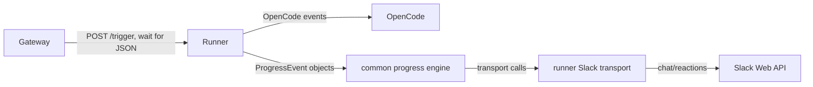

# Runner-owned Slack progress

Move Slack progress state and posting out of gateway and into runner while preserving queue handshake semantics and current Slack progress behavior.

## Goal

Gateway should only enqueue/dispatch triggers and wait for the runner's quick accepted/busy/rejected decision. Runner should own progress event consumption, state transitions, Slack message posting/updating/deletion, and terminal done/error rendering for Slack-thread-triggered work.

## Scope

**In scope**

- Move the progress state machine/formatting from `packages/gateway/src/progress-manager.ts` into `packages/common` behind a thin transport abstraction.
- Keep the concrete Slack transport adapter in `packages/runner` for this refactor.
- Resolve a progress target only from the current trigger `correlationKey` when it exactly matches `slack:thread:<channel>/<ts>`.
- Change runner `/trigger` from long-lived NDJSON to quick JSON after the prompt is accepted or a busy/rejected result is known.
- Remove gateway NDJSON progress relay/background-drain code and related tests/types.
- Preserve practical Slack behavior: 3-tool threshold, 10s throttling, elapsed heartbeat, formatting, prior-progress cleanup, done update, error visibility, abort-as-completed semantics, and Slack API error containment.

**Out of scope**

- General multi-platform progress framework or registry.
- Progress for non-current Slack aliases, approval outcome metadata, cron, GitHub, or arbitrary historical correlation lookups.
- Moving Slack intake or final agent-authored Slack replies out of gateway/OpenCode.
- New Slack UX beyond preserving existing progress semantics.

## Current design notes

- Runner already observes the OpenCode event stream and emits typed progress events (`start`, `tool`, `memory`, `delegate`, `done`, `error`, `heartbeat`) over NDJSON from `packages/runner/src/index.ts`.
- Gateway currently parses that NDJSON in `packages/gateway/src/service.ts`, then calls `packages/gateway/src/progress-manager.ts` to mutate progress state and call Slack.
- Gateway has two stream-maintenance paths that become dead code after this refactor: progress relay for Slack targets and background response drain for non-Slack non-cron triggers.
- The runner currently returns JSON only for early busy/error cases; accepted prompts enter the streaming response. The refactor should return JSON for accepted prompts too, after runner has started its own background event processing.

## Proposed architecture

### Shared progress engine contract

Add a common, transport-neutral progress module that owns the state machine and formatting but knows nothing about Slack SDK types:

- Input: current `ProgressEvent` objects from `@thor/common`.
- Session key: supplied by the caller, e.g. `channel:threadTs` from the runner adapter.
- Transport methods: `post`, `update`, `delete`, `addReaction`, plus structured identifiers such as `channel`, `threadTs`, and `sourceTs` carried in an opaque target object owned by the adapter.
- Logger/error handling: engine catches transport failures at the same boundaries as today so progress failures do not fail the prompt.
- Public testing helpers can remain for registry cleanup/inspection if useful, but should be package-neutral.

Keep Slack-specific Block Kit shaping and Web API timeout/client construction in runner-side Slack adapter code, not in common.

### Slack target resolution

Runner resolves progress target only from the current trigger request:

- If `correlationKey` matches `^slack:thread:([^/]+)/(.+)$`, use captured `channel` and `threadTs`; set `sourceTs = threadTs` for reactions unless later code passes a more precise trigger timestamp.
- Otherwise no progress target is created, and the shared progress engine is not invoked.
- Do not consult alias stores, approval payloads, or gateway-built `ProgressRelayTarget` in this refactor.

## Phases

### Phase 1 — Extract common progress engine

**Changes**

- Move `ProgressSession`, formatting helpers, threshold/tick behavior, registry cleanup, and `handleProgressEvent`-style orchestration out of `packages/gateway/src/progress-manager.ts` into `packages/common`.
- Replace direct Slack functions with a narrow transport interface implemented by tests with fakes.
- Keep `ProgressEvent` schemas in `packages/common/src/progress-events.ts`; reuse them rather than creating a second event model.
- Port gateway progress-manager tests to common-engine tests, preserving expectations for:
  - first post after 3 tool events
  - latest tool grouping and memory/delegate formatting
  - 10s throttling and elapsed ticker
  - done updates only existing messages
  - errors always visible via message update or source reaction
  - cleanup of completed messages and retention of capped error entries
  - abort errors treated as completed

**Exit criteria**

- Common package typechecks with no dependency on `@slack/web-api` or `@slack/types`.
- Existing progress behavior is covered by common tests before gateway relay removal.
- No change yet to runtime ownership other than import location if an intermediate compatibility shim is useful.

### Phase 2 — Add runner Slack progress adapter

**Changes**

- Add a runner-local Slack adapter module that creates/uses the Slack Web API client and implements the common transport interface.
- Move or duplicate only Slack Web API wrappers needed by progress (`postMessage`, `updateMessage`, `deleteMessage`, `addReaction`, context blocks/types) from gateway into runner without introducing common Slack dependencies.
- Wire runner trigger processing so, when the current `correlationKey` is `slack:thread:<channel>/<ts>`, emitted progress events are delivered directly to the common engine instead of written to the HTTP response.
- Keep event processing in runner alive after the HTTP accepted response by running the OpenCode event loop in a background task owned by runner, with errors converted to progress `error`/`done` where possible and logged otherwise.
- Ensure no progress engine instance/timer survives terminal `done`, `error`, or superseded `start` for the same Slack thread.

**Exit criteria**

- Runner unit tests prove Slack progress is posted/updated/deleted from runner for Slack correlation keys.
- Runner tests prove no progress transport calls happen for cron/GitHub/non-Slack correlation keys.
- Runner tests cover terminal success, terminal error, and busy-without-interrupt paths.

### Phase 3 — Change runner `/trigger` to quick JSON handshake

**Changes**

- Update runner `/trigger` response contract:
  - `{ "busy": true }` remains for resumed busy sessions when `interrupt` is false.
  - 4xx/5xx JSON remains for validation, directory, abort, or prompt submission failures.
  - accepted prompts return quick JSON such as `{ "accepted": true, "sessionId": "...", "resumed": false }` immediately after `promptAsync` succeeds and the background progress processor is started.
- Remove `Content-Type: application/x-ndjson`, `Transfer-Encoding: chunked`, response `emit()`, and NDJSON heartbeat from runner trigger handling.
- Keep trigger lifecycle bookkeeping (`startTrigger`, `endTrigger`) in the background processor so the viewer/session history still reaches completed/error/aborted states.
- Decide whether the accepted JSON shape needs a shared schema; prefer a small local schema/type unless another package consumes fields beyond `busy`.

**Exit criteria**

- Gateway can still distinguish busy vs accepted vs rejected/failed from the JSON response.
- Runner no longer holds the HTTP request open for accepted prompts.
- Existing runner behavior around session resolution, interrupt abort, memory injection, child-session progress forwarding, and terminal error grace is preserved.

### Phase 4 — Remove gateway relay and background drain

**Changes**

- Delete `ProgressRelayTarget`, `progressTarget`, `backgroundDrain`, `backgroundDrainLogEvent`, `consumeNdjsonStream`, `drainResponseBody`, `newlineStream`, `forwardProgressEvent`, and imports of `ProgressEventSchema`/`handleProgressEvent` from gateway service.
- Simplify `triggerRunnerPrompt` to POST, parse JSON, call `onAccepted` only for accepted JSON, return `{ busy: true }` for busy, and preserve existing 4xx rejection handling.
- Remove gateway progress-manager module after common extraction, or leave only unrelated Slack helpers if still needed elsewhere.
- Update gateway tests that currently simulate NDJSON relay/background drain to assert quick JSON handshake semantics instead.

**Exit criteria**

- Gateway package has no runner NDJSON consumption path.
- Queue ack/defer semantics remain intact: accepted triggers call `onAccepted`, busy triggers do not, rejected dispatch plans still call `onRejected`.
- Gateway tests no longer require fake NDJSON response bodies for runner triggers.

### Phase 5 — Integration verification and cleanup

**Changes**

- Run targeted package tests/typechecks for `common`, `runner`, and `gateway`.
- Update any docs/comments that describe runner streaming progress through gateway, including `docs/feat/mvp.md` if needed.
- Inspect logs/names for stale `progress_relay`, `ndjson_parse_skip`, or `runner_response_drain_error` references and remove or rename them.

**Exit criteria**

- Full workspace typecheck/test suite relevant to changed packages passes locally.
- A Slack-thread-triggered smoke test demonstrates runner-owned progress still posts after threshold, updates elapsed/latest activity, and cleans up/marks terminal state.
- A non-Slack trigger smoke/unit test demonstrates prompt acceptance returns promptly without progress transport calls.

## Decision log

| #   | Decision                                                                                    | Rationale                                                                                                   | Rejected                                                                                  |
| --- | ------------------------------------------------------------------------------------------- | ----------------------------------------------------------------------------------------------------------- | ----------------------------------------------------------------------------------------- |
| 1   | Put the progress engine in `@thor/common` with a narrow transport interface                 | Both runner and tests can share the state machine without giving common a Slack SDK dependency              | Keeping progress state in gateway; building a broad multi-platform notification framework |
| 2   | Keep the only concrete transport adapter in runner for now                                  | Ownership moves to the process that already consumes OpenCode events while keeping this refactor Slack-only | Adding gateway callbacks; adding adapters for cron/GitHub/other platforms now             |
| 3   | Resolve Slack progress target only from `slack:thread:<channel>/<ts>` correlation keys      | Matches the agreed simple target rule and avoids alias/approval edge cases in the migration                 | Looking up historical Slack aliases or deriving targets from payloads                     |
| 4   | Change accepted runner triggers to quick JSON and run progress processing in the background | Preserves gateway queue semantics without keeping an HTTP stream open                                       | Keeping NDJSON and requiring gateway to drain/relay it                                    |
| 5   | Preserve existing progress UX before making any visible improvements                        | This is an ownership refactor; behavior changes increase regression risk                                    | Reworking message format, thresholds, or cleanup policy in the same change                |

## Implementation risks

- **Background task error handling:** once runner returns accepted JSON, later event-loop failures cannot be reported through HTTP. Ensure they still end trigger lifecycle and render Slack error progress when a target exists.
- **Timer/resource leaks:** moving progress sessions into runner increases the importance of clearing heartbeat timers on done/error/superseded starts and on process-level errors.
- **Queue semantics regression:** gateway must call `onAccepted` only after accepted JSON, not for busy/rejected/failing responses, or Slack ack/defer behavior can change.
- **Slack target precision:** using thread timestamp as `sourceTs` is simple but may differ from the current trigger message timestamp for replies; reaction-on-error behavior should be checked against current expectations.
- **Common package dependency hygiene:** avoid importing Slack types or WebClient into `@thor/common`; keep transport payloads generic enough for tests and runner adapter.
- **Lost cleanup on silent sessions:** if a run completes before threshold, preserve today's silence; if it crosses threshold, preserve terminal update and completed-message cleanup behavior.

## Test plan

- `pnpm --filter @thor/common typecheck` and common progress tests.
- `pnpm --filter @thor/runner typecheck` and runner trigger tests covering accepted JSON, busy JSON, Slack progress, and non-Slack silence.
- `pnpm --filter @thor/gateway typecheck` and gateway service tests covering JSON handshake and dispatch planning.
- Final workspace-level test/typecheck command if practical after targeted suites pass.
