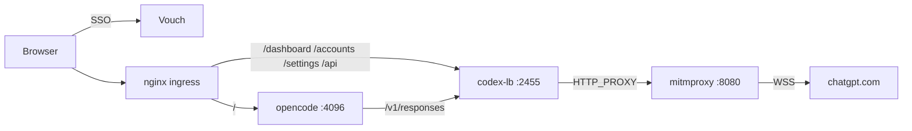

# codex-lb integration

Ship `ghcr.io/soju06/codex-lb` as the OpenAI-compatible upstream for opencode, fronted behind Thor's ingress auth gate.

## Goal

Let opencode use ChatGPT-backed `gpt-5*` models without minting paid OpenAI API keys. codex-lb pools one or more ChatGPT account credentials and exposes an OpenAI-compatible `/v1/responses` endpoint that opencode points at. Its dashboard for account/quota management lives behind the same Google SSO + admin-email gate as `/admin`.

## Scope

**In scope**

- New `codex-lb` service in `docker-compose.yml`, persisted via a host bind mount at `./docker-volumes/codex-lb:/var/lib/codex-lb`.
- opencode points its built-in `openai` provider at `http://codex-lb:2455/v1` with a literal API key the unauthenticated CIDR allowlist accepts.
- Outbound traffic from codex-lb goes through mitmproxy; the existing built-in passthrough for `openai.com` / `chatgpt.com` carries it.
- codex-lb trusts the mitmproxy CA (server.py uses aiohttp, which honors `SSL_CERT_FILE`).
- nginx routes `/dashboard`, `/accounts`, `/settings`, and `/api/*` to codex-lb behind `auth_request /vouch/validate` and the existing admin-email allowlist.
- `scripts/test-e2e.sh` probes the live ingress for the new routes and for unchanged regression paths (`/`, `/admin/config`, `/global/health`).
- `mitmproxy-ca-init.sh` produces an RFC 5280-compliant self-signed CA (Python 3.13 rejects bare `basicConstraints:CA:TRUE` without `keyUsage`).

**Out of scope**

- Multi-instance codex-lb fan-out, internal session bridge tuning, or any feature relying on the bridge.
- Per-user codex-lb API keys; the proxy is reachable from inside the Docker network only and is authenticated via Vouch at the ingress edge.
- Rotating or distributing the mitmproxy CA on host machines (still a manual `scripts/mitmproxy-ca-init.sh` step).
- Routing opencode → codex-lb through mitmproxy in production (debug-only; reverted).
- Exposing codex-lb on the public internet beyond the existing Vouch-protected ingress.

## Current design notes

- codex-lb listens on `2455` (API + dashboard) and `1455` (OAuth callback for `auth.openai.com`); both are bound to loopback on the host. The image runs as a non-root user and persists its SQLite store on the mounted volume.
- The mitmproxy addon's `passthrough` action is a policy bypass, **not** TLS passthrough — it still MITMs the TLS connection, so every container talking to passthrough hosts needs to trust the mitmproxy CA.
- opencode does **not** read codex-lb's `/v1/models`. Its built-in `openai` provider builds the model list from the `models.dev` snapshot compiled into the binary (it never issues an HTTP model-list call), and `models.dev`'s network endpoint is blocked by mitmproxy anyway. `small_model` pins title generation to `gpt-5.4-mini` and the provider `whitelist` narrows the snapshot's openai models to `gpt-5.4` / `gpt-5.4-mini` / `gpt-5.5` — all present in the pinned `opencode-ai@1.17.11` snapshot. Model selection therefore comes from the bundled snapshot, not the proxy.
  - Verify the exact pinned snapshot offline after every `opencode-ai` bump and before adding a model to `small_model`, an agent, or the provider whitelist:

    ```bash
    docker build --target opencode -t thor-opencode-snapshot-check .
    docker run --rm --network none --entrypoint opencode \
      thor-opencode-snapshot-check models openai
    ```

    The current pin must print `openai/gpt-5.4`, `openai/gpt-5.4-mini`, and `openai/gpt-5.5`. A future model such as `gpt-5.6` is supported by the pinned snapshot only when this offline command prints `openai/gpt-5.6`; do not infer support from codex-lb's live `/v1/models` response or from strings found in the binary.

  - `OPENCODE_DISABLE_MODELS_FETCH=true` disables the automatic startup and hourly `models.dev` refreshes, which egress policy blocks anyway. OpenCode still loads a disk cache first and then the snapshot embedded in the pinned binary. An operator can still explicitly request the network path with `opencode models --refresh`; normal server operation never does so.

- `CODEX_LB_MODEL_REGISTRY_ENABLED=false` disables codex-lb's model-registry refresh scheduler, whose periodic Codex-CLI-version lookup against GitHub/npm is egress-blocked and otherwise logs a full traceback every cycle. Disabling it removes that noise; `/v1/responses` still routes (the request path degrades gracefully) and opencode is unaffected since it never consumes codex-lb's `/v1/models`.
  - **Caveat / latent coupling:** this holds only while every whitelisted model (and `small_model`) exists in opencode's bundled `models.dev` snapshot. A future opencode bump that drops `gpt-5.4*`, or a codex-lb-only model slug added to the whitelist, would make opencode depend on a populated `/v1/models` — re-enable the registry (or whitelist GitHub/npm egress) in that case.

## Architecture



## Phases

### Phase 1 — Add codex-lb container — _shipped in `f7769aa9`_

- New service block in `docker-compose.yml` with ports, a `./docker-volumes/codex-lb:/var/lib/codex-lb` host bind mount for the SQLite store, and a healthcheck dependency on mitmproxy.
- `mitmproxy-egress-env` YAML anchor reused by both codex-lb and opencode.
- `CODEX_LB_PROXY_UNAUTHENTICATED_CLIENT_CIDRS` covers the Docker bridge subnets so opencode can call codex-lb without minting a real API key.

**Exit criteria:** `docker compose up -d codex-lb` and codex-lb's dashboard reachable at `http://localhost:2455`.

### Phase 2 — Trust the mitmproxy CA inside codex-lb — _shipped in `964d2da8` and `f30b626f`_

- Mount `./docker-volumes/mitmproxy/public:/etc/thor/mitmproxy-public:ro` on codex-lb.
- Set `SSL_CERT_FILE`, `REQUESTS_CA_BUNDLE`, `CURL_CA_BUNDLE`.
- Update `scripts/mitmproxy-ca-init.sh` to emit `keyUsage=critical,keyCertSign,cRLSign` and `basicConstraints=critical,CA:TRUE` so the CA verifies under Python 3.13's X.509 strict mode.

**Exit criteria:** codex-lb successfully completes the OAuth handshake against `auth.openai.com` through mitmproxy.

### Phase 3 — Point opencode at codex-lb — _shipped in `f7769aa9` / `05c402c3`_

- `docker/opencode/config/opencode.json` sets `provider.openai.options.baseURL = http://codex-lb:2455/v1`, `apiKey = codex-lb-local` (literal — satisfies opencode's header requirement, accepted by codex-lb's unauthenticated CIDR path).
- `small_model: openai/gpt-5.4-mini` and a provider `whitelist` so the picker only surfaces models codex-lb serves.

**Exit criteria:** opencode session reaches gpt-5.4 for build and gpt-5.4-mini for title generation; both calls return 200 from codex-lb.

### Phase 4 — Fix title generation by disabling the session bridge — _shipped in `94b1879a`_

- `CODEX_LB_HTTP_RESPONSES_SESSION_BRIDGE_ENABLED=false`.
- Verified by reading the conversation-archive jsonl during diagnosis: ChatGPT emitted `response.output_text.delta` events, but the downstream HTTP stream lost everything between `response.created` (seq 0–1) and `response.completed` (seq 10).

**Exit criteria:** new opencode sessions get human-readable titles instead of `New session - <ts>`.

### Phase 5 — Route codex-lb dashboard through ingress — _shipped in `7da611c9`_

- New `$codex_lb_admin_upstream` map in `docker/ingress/nginx.conf.template`.
- `location ~ ^/(dashboard|accounts|settings|api)(/|$)` block with the same `auth_request /vouch/validate` and admin-email gate as `/admin/`.
- `ingress.depends_on` adds `codex-lb` so cold starts don't 502.
- `scripts/test-e2e.sh` gains an `=== Ingress Routing ===` section probing the live nginx for the new routes plus `/`, `/admin/config`, `/global/health`.
- The TypeScript static-config simulator (`docker/ingress/nginx-template.test.ts`) was deleted in favor of these live probes.

**Exit criteria:** unauthenticated browser hits to `/dashboard` redirect to `/vouch/login`; admin user hits land on the codex-lb dashboard; `pnpm test` passes; `scripts/test-e2e.sh` passes.

## Decision log

| #   | Decision                                                                           | Rationale                                                                                                                                                                                                                                                                                                                                 | Rejected                                                                                                                                                                                                                                                                                            |
| --- | ---------------------------------------------------------------------------------- | ----------------------------------------------------------------------------------------------------------------------------------------------------------------------------------------------------------------------------------------------------------------------------------------------------------------------------------------- | --------------------------------------------------------------------------------------------------------------------------------------------------------------------------------------------------------------------------------------------------------------------------------------------------- |
| 1   | Disable codex-lb's HTTP responses session bridge entirely                          | Multiplexing concurrent same-session calls onto one upstream WS dropped text deltas for the title agent. Each request opening its own upstream stream is slower but observably correct.                                                                                                                                                   | Patching the bridge router; sequencing opencode's title and build forks                                                                                                                                                                                                                             |
| 2   | Mount the mitmproxy CA into codex-lb and rely on aiohttp's `SSL_CERT_FILE`         | codex-lb is Python/aiohttp, which honors the env var. mitmproxy "passthrough" is a policy decision, not TLS bypass — every container hitting a passthrough host needs the CA                                                                                                                                                              | Switching the openai.com/chatgpt.com policy to true TLS passthrough; teaching codex-lb to use a per-request `verify=`                                                                                                                                                                               |
| 3   | Use the built-in `openai` provider in opencode (not `openai-compatible`)           | The `openai-compatible` adapter uses Chat Completions and drops reasoning content; the built-in `openai` provider uses the Responses API which codex-lb speaks natively                                                                                                                                                                   | Custom provider entry; using `openai-compatible` and accepting missing reasoning                                                                                                                                                                                                                    |
| 4   | Pin `small_model: openai/gpt-5.4-mini` with a provider whitelist                   | Without pinning, opencode picked `gpt-5.4` (full-tier reasoning) for the title agent. The whitelist narrows the bundled snapshot to the models codex-lb serves                                                                                                                                                                            | Whitelisting `models.dev` in mitmproxy; using `gpt-5.4` for everything                                                                                                                                                                                                                              |
| 5   | Add `keyUsage` and explicit critical `basicConstraints` to the self-signed mitm CA | Python 3.13 / OpenSSL 3 reject CA certs lacking `keyUsage=keyCertSign` under strict X.509 verification                                                                                                                                                                                                                                    | Disabling strict verification per-client; using a different CA generator                                                                                                                                                                                                                            |
| 6   | Hardcode `apiKey: "codex-lb-local"` in opencode config; allow Docker CIDRs         | Keeps the config self-contained and avoids env-var interpolation. codex-lb's `proxy_unauthenticated_client_cidrs` accepts the Docker bridge subnet so no real key is needed                                                                                                                                                               | Provisioning a real `sk-clb-…` key; routing through the ingress with admin auth (still works but adds a round-trip)                                                                                                                                                                                 |
| 7   | Route `/dashboard`, `/accounts`, `/settings`, `/api/*` to codex-lb via nginx       | Matches codex-lb's HTML routes plus its dashboard XHR namespace. opencode's `/api/*` endpoints exist but aren't called by its SPA in the browser; backend callers hit opencode directly                                                                                                                                                   | Mounting codex-lb under a `/codex-lb/` prefix (breaks codex-lb's absolute paths); a subdomain (more infra)                                                                                                                                                                                          |
| 8   | Replace the nginx-template static simulator with live `scripts/test-e2e.sh` probes | The TS simulator hand-rolled nginx's location-priority rules and didn't actually run nginx. Live probes catch real routing/auth regressions and align with AGENTS.md rule #7                                                                                                                                                              | Keeping the simulator and adding an integration test alongside; teaching the simulator about regex location precedence                                                                                                                                                                              |
| 9   | Try codex-lb first at `/assets/`, fall back to opencode on 404                     | The shared `/assets/` fallback is asymmetric: codex-lb's `spa_fallback` raises a real 404 for unknown `/assets/<hash>` (`app/main.py`), while opencode's SPA returns 200 + index.html. With opencode first, the fallback never fires; flipping the order makes the original "try X → on 404 try Y" design work without any body rewriting | Rebase codex-lb at `/cl-assets/` via `sub_filter` (adds edge HTML/JS/CSS rewriting on every codex-lb response); `Referer`-based routing (Vite child chunks carry the parent script URL, not `/dashboard`); forking codex-lb with Vite `base: '/codex-lb/'` (rebuild + re-merge on every image bump) |
| 10  | Disable OpenCode's automatic `models.dev` fetches                                  | The pinned binary embeds the catalog and the offline check gates model additions. Startup and hourly refreshes can only fail under the server's egress policy, so suppressing them removes network noise without changing the selected models                                                                                             | Allowing `models.dev` through mitmproxy; tolerating a failed request on startup and every hour                                                                                                                                                                                                      |

## Implementation risks

- **Bridge-disabled cost / rate-limit pressure.** Each opencode call now opens its own upstream WebSocket. Heavy parallel use could hit ChatGPT's session limits faster. Re-enable the bridge only if codex-lb publishes a fix for the cross-call event-routing bug.
- **CA re-trust on regen.** Running `scripts/mitmproxy-ca-init.sh` after deleting the existing CA invalidates any host trust stores that imported it. Document the regen sequence in the script header and require explicit deletion before regenerating.
- **codex-lb path drift.** The ingress regex assumes codex-lb's dashboard uses `/dashboard|accounts|settings|api`. If a future codex-lb version adds a top-level prefix (e.g. `/usage`), the ingress block must learn it or those routes 404 inside the SPA.
- **`/api/*` collision.** opencode's HTTP API also lives under `/api/*` but the browser SPA does not call it; internal Thor services hit opencode directly on its container port. Any future change that routes browser traffic through `/api/*` to opencode would need a more specific nginx prefix here.
- **No conversation archive in production.** The `CODEX_LB_CONVERSATION_ARCHIVE_ENABLED` and `CODEX_LB_LOG_PROXY_REQUEST_PAYLOAD` flags were debug-only and were reverted. Re-enable them ad hoc when debugging upstream behavior.

## Test plan

- `pnpm test` — workspace unit/integration suites.
- `scripts/test-e2e.sh` — the new `=== Ingress Routing ===` section asserts:
  - `/global/health` returns 200 with no auth.
  - `/`, `/admin/config`, `/dashboard`, `/accounts`, `/settings`, `/api/accounts` each return `302 -> /vouch/login` unauthenticated.
- Manual: log in via Vouch as an admin email, visit `/dashboard`, add a ChatGPT account, confirm a fresh opencode session generates a real title (not `New session - <ts>`).

## Environment variables added

Per AGENTS.md rule #6, these need to land in every required surface in the same change set:

- `CODEX_LB_HTTP_RESPONSES_SESSION_BRIDGE_ENABLED` — set to `false` in `docker-compose.yml`; not a deployment knob.
- `CODEX_LB_PROXY_UNAUTHENTICATED_CLIENT_CIDRS` — set in `docker-compose.yml` to the Docker private ranges; not a deployment knob.
- `CODEX_LB_DASHBOARD_AUTH_MODE=disabled`, `CODEX_LB_UPSTREAM_WEBSOCKET_TRUST_ENV=true` — same; container-local.
- `INGRESS_URL` — new optional override in `scripts/test-e2e.sh`, defaults to `http://localhost:${INGRESS_PORT:-8080}`.

No new top-level secrets and no new variables in `.env.example` / `README.md` / GitHub workflows — codex-lb's runtime config is fully inside the compose file.
