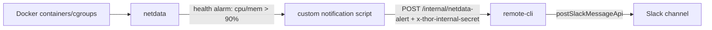

# Netdata compose monitoring

Add Netdata to the Thor Docker Compose deployment so operators get Slack alerts when any Compose container crosses 90% CPU or memory usage.

## Goal

Ship a self-hosted Netdata agent in `docker-compose.yml` with host-mounted Netdata state under `./docker-volumes/`, custom container CPU/memory alarms, and a secret-gated alert delivery path into `remote-cli` that posts to a Slack channel configured by environment variable.

## Current state

- `docker-compose.yml` currently runs `remote-cli`, `grafana-mcp`, `mitmproxy`, `codex-lb`, `opencode`, `runner`, `gateway`, `cron`, `admin`, `vouch`, and `ingress`. Host-mounted state already lives under `./docker-volumes/*` for services such as `remote-cli`, `opencode`, `mitmproxy`, `codex-lb`, and the shared workspace.
- `.env.example` and `README.md` follow AGENTS.md environment-variable discipline: any new env var must be reflected in compose, examples, README Deployment Configuration, and relevant tests/fixtures.
- `remote-cli` exposes regular `/exec/*` endpoints and the secret-gated `POST /internal/exec` endpoint. `/internal/exec` should not be used for Netdata alerts because alert delivery is not arbitrary command execution.
- `remote-cli` already has a controlled Slack posting implementation:
  - `packages/remote-cli/src/slack-post-message.ts` exports `postSlackMessageApi(...)`, which posts directly to Slack `chat.postMessage` using `SLACK_BOT_TOKEN` and optional `SLACK_API_BASE_URL`.
  - `handleSlackPostMessage(...)` and `POST /exec/slack-post-message` add Thor-session validation and alias registration for agent-authored messages; that session-bound path is not appropriate for Netdata because Netdata alerts are operator events, not OpenCode-session messages.
  - The new internal alert endpoint should reuse `postSlackMessageApi(...)` directly.
- Internal auth already uses `THOR_INTERNAL_SECRET` and the `x-thor-internal-secret` header via `matchesInternalSecret(...)` in `@thor/common`; the Netdata callback should use the same pattern.

## Scope

**In scope**

- Add a `netdata` service to `docker-compose.yml`.
- Persist Netdata config/lib/cache below `./docker-volumes/netdata/`:
  - `./docker-volumes/netdata/config:/etc/netdata`
  - `./docker-volumes/netdata/lib:/var/lib/netdata`
  - `./docker-volumes/netdata/cache:/var/cache/netdata`
- Mount Docker/container metadata needed for cgroup/container monitoring, including Docker socket read-only and host proc/sys views per the chosen Netdata image guidance.
- Add Netdata health alarm config for Docker container CPU and memory usage over 90%.
- Add a narrow secret-gated `remote-cli` internal endpoint, `POST /internal/netdata-alert`, that validates a Netdata alert payload and posts a formatted Slack message to `SLACK_SUPPORT_CHANNEL_ID` via `postSlackMessageApi(...)`.
- Add/update env docs for `SLACK_SUPPORT_CHANNEL_ID`, optional `NETDATA_PUBLIC_URL`, and any Netdata callback URL/notification toggles.
- Add behavior-focused tests around alert auth, payload validation, Slack success/failure, and compose/config presence where practical.

**Out of scope**

- Replacing Docker healthchecks with Netdata alarms. Keep existing Compose healthchecks for startup dependencies; use Netdata for runtime resource alerts.
- Public-open Netdata UI exposure. The chosen design exposes Netdata only through ingress behind Vouch/admin auth at `/netdata/` and does not publish a direct host port.
- Building a general Slack webhook/proxy in `remote-cli`.
- Full alert deduplication/state management in Thor. Netdata's health engine should own alarm state transitions and repeat policy.
- Adding Prometheus/Grafana-based alerting; this plan is specifically Netdata-agent based.

## Proposed architecture

## Implementation phases

### Phase 1 — Add Netdata container and persistent paths

Changes:

- Add `netdata` service in `docker-compose.yml` using a pinned `netdata/netdata` image tag rather than `latest`.
- Mount Netdata state under `./docker-volumes/netdata/` as listed above.
- Mount Docker/container sources needed by Netdata, expected shape:
  - `/var/run/docker.sock:/var/run/docker.sock:ro`
  - `/proc:/host/proc:ro`
  - `/sys:/host/sys:ro`
  - `/etc/os-release:/host/etc/os-release:ro` if needed by the image
- Evaluate required capabilities from the pinned image docs (`SYS_PTRACE`, possibly `SYS_ADMIN`, `security_opt: apparmor:unconfined`). Prefer the minimum set that still collects per-container CPU and memory metrics.
- Do not publish a direct host port for the Netdata UI; expose it through ingress at `/netdata/` behind Vouch/admin auth.
- Add `remote-cli` to Netdata's notification reachability path through Docker DNS (`http://remote-cli:3004/...`) and add `depends_on: remote-cli: condition: service_healthy` if the notification script assumes the URL at startup.

Exit criteria:

- `docker compose config` renders the `netdata` service without unresolved variables.
- `docker compose up -d netdata` starts the service and Netdata sees the Thor Compose containers in its dashboard/API.
- Netdata writes config/lib/cache to `./docker-volumes/netdata/*` and does not create anonymous volumes for persistent state.

### Phase 2 — Configure Netdata 90% CPU/memory alarms

Changes:

- Add Netdata config files under a repo-owned path such as `docker/netdata/` and mount/copy them into `./docker-volumes/netdata/config` or directly into `/etc/netdata` through compose. Keep the runtime data under `./docker-volumes/netdata/*`.
- Define custom health alarms for Docker container CPU and memory utilization crossing 90%.
- Prefer Netdata health alarms over Docker healthchecks for this requirement because Docker healthchecks are per-service liveness probes and do not provide threshold state, notification repeats, or dimensional container resource charts.
- Scope alarm matching carefully so every Thor container is covered but Netdata itself does not create noisy self-alert loops unless explicitly desired.
- Set reasonable hysteresis/repeat behavior (for example, trigger critical at `> 90` for a sustained window and recover below a lower threshold) to reduce transient CPU spike noise.

Exit criteria:

- A local stress test against one container can force a CPU or memory alarm over 90% and then recover.
- Netdata event log shows the expected alarm names and affected container/chart dimensions.
- Alarm definitions are documented enough that future operators can tune thresholds without code changes.

### Phase 3 — Add `remote-cli` internal Netdata alert endpoint

Changes:

- Add a small module, likely `packages/remote-cli/src/netdata-alert.ts`, that:
  - parses a minimal Netdata payload (`status`, `alarm`, `chart`, `family`, `host`, `value`, `oldStatus`, `summary`/`info`, timestamps/IDs if available),
  - rejects malformed payloads before posting,
  - formats Slack mrkdwn with status, container/chart, current value, threshold, and Netdata URL if configured,
  - calls `postSlackMessageApi(...)` from `packages/remote-cli/src/slack-post-message.ts`.
- Add `POST /internal/netdata-alert` in `packages/remote-cli/src/index.ts`.
- Authenticate with `x-thor-internal-secret` and `matchesInternalSecret(...)`, matching `/internal/exec` and `/exec/mcp resolve`.
- Add `SLACK_SUPPORT_CHANNEL_ID` to `loadRemoteCliEnv(...)` or a small alert-specific env loader. Keep `SLACK_BOT_TOKEN` and `SLACK_API_BASE_URL` reused from existing remote-cli env.
- Consider `NETDATA_PUBLIC_URL` optional for Slack links to the ingress Netdata UI; do not make it required.
- Do not require or synthesize `x-thor-session-id`; no Slack alias should be registered for infrastructure alerts.

Exit criteria:

- Missing/incorrect `x-thor-internal-secret` returns 401 and does not call Slack.
- Missing `SLACK_SUPPORT_CHANNEL_ID` fails clearly at startup or returns a deterministic 503/400, per final design.
- Valid payload calls Slack once through `postSlackMessageApi(...)`; Slack `ok:false` returns a non-2xx response and logs structured error metadata without secrets.
- Unit tests cover auth, validation, formatting basics, Slack failure, and no session/alias requirement.

### Phase 4 — Wire Netdata notification delivery

Changes:

- Add Netdata notification config that sends alarms to `http://remote-cli:3004/internal/netdata-alert`.
- Use `THOR_INTERNAL_SECRET` in the notification request header. If Netdata's built-in custom notification cannot set headers cleanly, mount a small repo-owned script such as `docker/netdata/notify-remote-cli.sh` and configure Netdata's `custom_sender()` to call it.
- Pass only the endpoint URL and secret through the `netdata` service environment; the Slack channel should live in `remote-cli` as `SLACK_SUPPORT_CHANNEL_ID` so Netdata cannot choose arbitrary Slack destinations.
- Ensure the notification script redacts the secret from logs and exits non-zero on HTTP failure so Netdata records failed notifications.

Exit criteria:

- Triggering the test CPU/memory alarm produces one Slack message in `SLACK_SUPPORT_CHANNEL_ID`.
- `docker compose logs netdata remote-cli` shows the notification path without leaking `THOR_INTERNAL_SECRET` or `SLACK_BOT_TOKEN`.
- Recovery notifications are either enabled and formatted clearly or intentionally disabled/documented.

### Phase 5 — Docs and verification

Changes:

- Update `.env.example` with a Netdata/monitoring section:
  - `SLACK_SUPPORT_CHANNEL_ID=C0123456789`
  - optional `NETDATA_PUBLIC_URL=http://localhost:8080/netdata/`
- Update `README.md`:
  - Services table: add `netdata` on port `19999` if exposed.
  - Quick Start: pre-create any Netdata writable host directories if required by container user ownership.
  - Deployment Configuration table: add new Netdata vars.
  - Operations Notes: describe where Netdata data/config/cache live and how to test an alert.
- Add/update tests:
  - `packages/common/src/service-env.test.ts` for env loading if new loader fields are added.
  - `packages/remote-cli/src/netdata-alert.test.ts` or equivalent endpoint tests.
  - A lightweight compose/config check if the repo has a pattern for static compose verification; otherwise document `docker compose config` as manual verification.

Exit criteria:

- `pnpm --filter @thor/remote-cli test` or targeted vitest files pass.
- `pnpm test` and `pnpm typecheck` pass or unrelated failures are documented.
- `docker compose config` passes.
- Manual alert smoke test evidence is captured in the PR description.

## Environment variables to add

| Variable | Required | Service | Purpose |
|---|---:|---|---|
| `SLACK_SUPPORT_CHANNEL_ID` | Yes for alert delivery | `remote-cli` | Slack channel ID where Netdata alerts are posted. Keep destination enforcement in `remote-cli`, not in Netdata payloads. |
| `NETDATA_PUBLIC_URL` | No | `remote-cli` | Optional base URL included in Slack alerts so operators can click through to Netdata. |

The Netdata service may also receive container-local env such as `NETDATA_ALERT_WEBHOOK_URL=http://remote-cli:3004/internal/netdata-alert`; prefer hardcoding this in compose because it is an internal service URL, not an operator deployment knob.

## Decision log

| # | Decision | Rationale | Rejected |
|---|---|---|---|
| 1 | Use Netdata health alarms for CPU/memory thresholds, not Docker healthchecks | Healthchecks answer liveness; Netdata health alarms understand metric thresholds, state transitions, repeats, and notification delivery. | Per-container `healthcheck` commands or a custom polling cron. |
| 2 | Add a purpose-built `POST /internal/netdata-alert` endpoint | Keeps alert delivery narrow and auditable. `/internal/exec` would turn monitoring into arbitrary command execution. | Calling `/internal/exec` to run `slack-post-message`; exposing a generic Slack webhook. |
| 3 | Reuse `postSlackMessageApi(...)` from `packages/remote-cli/src/slack-post-message.ts` | It is the existing direct Slack `chat.postMessage` helper with token/base-url handling. `handleSlackPostMessage(...)` is session-bound and would incorrectly require OpenCode alias state. | Duplicating Slack fetch code; using `/exec/slack-post-message`. |
| 4 | Authenticate Netdata with `THOR_INTERNAL_SECRET` and `x-thor-internal-secret` | Matches existing internal remote-cli surfaces and avoids adding a second secret unless operationally required later. | No auth because traffic is Docker-internal; Slack signing-secret style HMAC. |
| 5 | Keep `SLACK_SUPPORT_CHANNEL_ID` in `remote-cli` env | Netdata should report alert facts, not choose Slack destinations. This limits payload spoofing impact after internal auth. | Sending channel ID from Netdata payload. |
| 6 | Persist config/lib/cache under `./docker-volumes/netdata/` | Matches the user's requirement and existing Compose convention for host-mounted state. | Anonymous Docker volumes; writing config inside the image. |
| 7 | Expose Netdata UI only through Vouch-protected ingress | The current public edge is Vouch/ingress controlled; avoiding a direct host port prevents unauthenticated observability UI exposure. | Public `0.0.0.0:19999` bind; direct localhost bind as the primary access path. |

## Risks and mitigations

- **Netdata alarm chart-name drift.** Netdata's Docker/cgroup chart names can vary by image version and host cgroup mode. Mitigate by pinning the image, testing against the actual Compose stack, and naming chart patterns in comments near the alarm config.
- **Alert noise from transient spikes.** A raw `>90%` threshold can flap. Use sustained windows/hysteresis and document repeat/recovery behavior.
- **Secret exposure in Netdata scripts.** Notification scripts need `THOR_INTERNAL_SECRET`; keep it in env only, avoid `set -x`, and do not log request headers.
- **Docker socket read-only is still sensitive.** Netdata needs the socket for container metadata, but even read-only socket access exposes container inventory. Keep Netdata trusted and do not expose its UI publicly.
- **Compose alerting depends on monitoring env.** If `SLACK_SUPPORT_CHANNEL_ID` is missing, the endpoint returns a deterministic failure and Netdata records notification delivery failure; existing deployments should add it before relying on alerts.

## Verification expectations

- Static/config: `docker compose config`.
- Unit: targeted `remote-cli` tests for `/internal/netdata-alert` and env loader tests.
- Workspace: `pnpm test` and `pnpm typecheck` before PR.
- Manual smoke:
  1. Start `remote-cli` and `netdata`.
  2. Trigger CPU or memory pressure in a non-critical test container.
  3. Confirm Netdata alarm changes to critical at `>90%`.
  4. Confirm Slack receives a message in `SLACK_SUPPORT_CHANNEL_ID`.
  5. Confirm recovery behavior and no secret leakage in logs.
